# ゼロからのOS自作入門

## 2021/05/01 （1日目）

WSLのUbuntu 18.04で作業。

開発環境は以下の通り。
- Windows10
- Ubuntu 18.04 on WSL2
- Visual Studio Code

```bash
$ sudo apt update && sudo apt upgrade
$ sudo apt install qemu
```

BZで謎の数列を書く。

```shell
$ hexdump -C BOOTX64.EFI
00000000  4d 5a 00 00 00 00 00 00  00 00 00 00 00 00 00 00  |MZ..............|
00000010  00 00 00 00 00 00 00 00  00 00 00 00 00 00 00 00  |................|
*
00000030  00 00 00 00 00 00 00 00  00 00 00 00 80 00 00 00  |................|
00000040  00 00 00 00 00 00 00 00  00 00 00 00 00 00 00 00  |................|
*
00000080  50 45 00 00 64 86 02 00  00 00 00 00 00 00 00 00  |PE..d...........|
00000090  00 00 00 00 f0 00 22 02  0b 02 00 00 00 02 00 00  |......".........|
000000a0  00 02 00 00 00 00 00 00  00 10 00 00 00 10 00 00  |................|
000000b0  00 00 00 40 01 00 00 00  00 10 00 00 00 02 00 00  |...@............|
000000c0  00 00 00 00 00 00 00 00  06 00 00 00 00 00 00 00  |................|
000000d0  00 30 00 00 00 02 00 00  00 00 00 00 0a 00 60 81  |.0............`.|
000000e0  00 00 10 00 00 00 00 00  00 10 00 00 00 00 00 00  |................|
*
00000100  00 00 00 00 10 00 00 00  00 00 00 00 00 00 00 00  |................|
00000110  00 00 00 00 00 00 00 00  00 00 00 00 00 00 00 00  |................|
*
00000180  00 00 00 00 00 00 00 00  2e 74 65 78 74 00 00 00  |.........text...|
00000190  14 00 00 00 00 10 00 00  00 02 00 00 00 02 00 00  |................|
000001a0  00 00 00 00 00 00 00 00  00 00 00 00 20 00 50 60  |............ .P`|
000001b0  2e 72 64 61 74 61 00 00  1c 00 00 00 00 20 00 00  |.rdata....... ..|
000001c0  00 02 00 00 00 04 00 00  00 00 00 00 00 00 00 00  |................|
000001d0  00 00 00 00 00 00 50 40  00 00 00 00 00 00 00 00  |......P@........|
000001e0  00 00 00 00 00 00 00 00  00 00 00 00 00 00 00 00  |................|
*
00000200  48 83 ec 28 48 8b 4a 40  48 8d 15 f1 0f 00 00 ff  |H..(H.J@H.......|
00000210  51 08 eb fe 00 00 00 00  00 00 00 00 00 00 00 00  |Q...............|
00000220  00 00 00 00 00 00 00 00  00 00 00 00 00 00 00 00  |................|
*
00000400  48 00 65 00 6c 00 6c 00  6f 00 2c 00 20 00 77 00  |H.e.l.l.o.,. .w.|
00000410  6f 00 72 00 6c 00 64 00  21 00 00 00 00 00 00 00  |o.r.l.d.!.......|
00000420  00 00 00 00 00 00 00 00  00 00 00 00 00 00 00 00  |................|
*
00000600
$ sum BOOTX64.EFI
12430     2
```

作った謎ファイルを使ってイメージファイルを作る。

```shell
$ qemu-img create -f raw disk.img 200M
Formatting 'disk.img', fmt=raw size=209715200
$ mkfs.fat -n 'MIKAN OS' -s 2 -f 2 -R 32 -F 32 disk.img
mkfs.fat 4.1 (2017-01-24)
$ mkdir -p mnt
$ sudo mount -o loop disk.img mnt
$ sudo mkdir -p mnt/EFI/BOOT
$ sudo cp BOOTX64.EFI mnt/EFI/BOOT/BOOTX64.EFI
```

WSLで必要なファイルを取ってくる。

```shell
$ git clone https://github.com/uchan-nos/mikanos-build.git osbook
```

VcXsrvを起動しておく。
ウィンドウを出すには、WSLのIPアドレスがXXX.YYY.ZZZ.AAAとすると、

```shell
$ export DISPLAY=XXX.YYY.ZZZ.AAA:0.0
```
と設定しておく。

```shell
$ qemu-system-x86_64 \
  -drive if=pflash,file=/mnt/e/work_dir/os/osbook/devenv/OVMF_CODE.fd \
  -drive if=pflash,file=/mnt/e/work_dir/os/osbook/devenv/OVMF_VARS.fd \
  -hda disk.img
```

なんかでた。


## 2021/05/02 （2日目）

p.43の`hello.c`を準備。

開発環境が入っていなかったのでインストール。

```sh
$ sudo apt install build-essential
$ sudo apt install clang lld
```

`Makefile`を準備していざコンパイルしようとしたけど、やっぱりエラーが出た。
`EFI_STATUS`の定義がないから変だと思ってた。開発環境に入ってた`hello.c`を見たら、いろいろ定義が入ってた。
確かに本文を読むと、`EfiMain`だけ取り出して説明していることになってた。

```cpp:hello.c
typedef unsigned short CHAR16;
typedef unsigned long long EFI_STATUS;
typedef void *EFI_HANDLE;

struct _EFI_SIMPLE_TEXT_OUTPUT_PROTOCOL;
typedef EFI_STATUS (*EFI_TEXT_STRING)(
  struct _EFI_SIMPLE_TEXT_OUTPUT_PROTOCOL  *This,
  CHAR16                                   *String);

typedef struct _EFI_SIMPLE_TEXT_OUTPUT_PROTOCOL {
  void             *dummy;
  EFI_TEXT_STRING  OutputString;
} EFI_SIMPLE_TEXT_OUTPUT_PROTOCOL;

typedef struct {
  char                             dummy[52];
  EFI_HANDLE                       ConsoleOutHandle;
  EFI_SIMPLE_TEXT_OUTPUT_PROTOCOL  *ConOut;
} EFI_SYSTEM_TABLE;

EFI_STATUS EfiMain(EFI_HANDLE        ImageHandle,
                   EFI_SYSTEM_TABLE  *SystemTable) {
  SystemTable->ConOut->OutputString(SystemTable->ConOut, L"Hello, world!\n");
  while (1);
  return 0;
}
```

昨日はNTFSで作ったディレクトリ`mnt`をマウントポイントに設定できてたのに、今日はできない。
昨日はWSL2の環境で動かしてたのに対し、いまWSL1の環境で作業してる。これが原因？

`osbook/devenv/run_emu.sh` を使って実行してもうまくいかなかった。

WSL2に変更した

```shell
> wsl --set-version Ubuntu-18.04 2
```

```sh
$ cd day01
$ make hello.efi
$ ./run_hello.sh
```

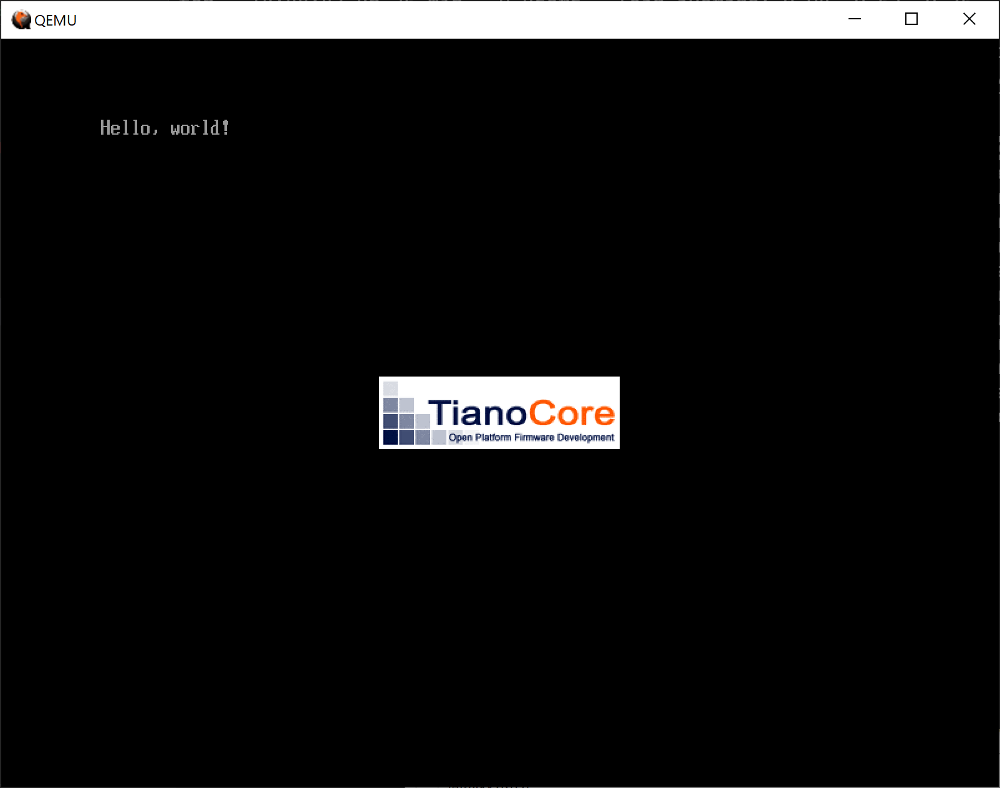

でた！

## 2021/05/03 （3日目）

開発環境をセットしきってなかった。
`https://github.com/uchan-nos/mikanos-build.git` の `devenv/ansible-provision.yml` にセットアップ方法がまとまってた。`ansible`を使う手順が書いてあったけど、中身を見て自分で打ち込んでみる。

```sh
$ sudo apt install build-essential llvm-7-dev lld-7 clang-7 nasm acpica-tools u
uid-dev qemu-system-x86 qemu-utils xauth unzip python3-distutils
$ cd osbook/devenv
$ git clone https://github.com/tianocore/edk2.git
$ cd edk2
$ git checkout -b 38c8be123aced4cc8ad5c7e0da9121a181b94251
$ cd ..
$ wget https://github.com/uchan-nos/mikanos-build/releases/download/v2.0/x86_64-elf.tar.gz
$ tar xf x86_64-elf.tar.gz
```

`clang-7`という感じでバージョン番号がついているファイルを、ついてないファイルにシンボリックしなおしていたので、`day02/rename_ln.sh`で対処した。

```sh
$ sudo day02/rename_ln.sh
```

これで開発環境ができた。

あとこれを、`.profile`に追加しておくと、Xウィンドウが出てくるようになる。
```
export DISPLAY=$(awk '/nameserver / {print $2; exit}' /etc/resolv.conf 2>/dev/null):0
```

2日目のデータ（`osbook_day02a`）を取り出すために、`Mikan OS`のリポジトリを取ってくる。

```sh
$ git clone https://github.com/uchan-nos/mikanos.git
```

```sh
$ cd mikanos
$ git checkout -b osbook_day02a
```

せっかくなので写経してみる。。。

`PACKAGE_GUID`は自分で作ったのを使ってみる。`uuidgen`というのが使えた。

```sh
$ uuidgen
dbe19b51-65ba-4b01-a8cd-b194af164088
```

写経したのでコンパイルしてみる。
さっきダウンロードした`edk2`の環境に、写経したファイルの入っているディレクトリのシンボリックリンクを作る。

```sh
$ cd osbllk/devenv/edk2
$ ln -s ../../../day02/MikanLoaderPkg .
```

開発環境にある`edksetup.sh`を読み込む。`conf`の下にファイルができる。
```sh
$ source edksetup.sh
$ ls Conf
BuildEnv.sh  ReadMe.txt  build_rule.txt  target.txt  tools_def.txt
```

`Conf/target.txt`を編集する。変更する箇所は下記の4か所。

- ACITVE_PLATFORM = MikanLoaderPkg/MikanLoaderPkg.sdc
- TARGET = DEBUG
- TARGET_ARCH = X64
- TOOL_CHAIN_TAG = CLANG38

ビルドする。

```sh
$ pwd
.../osbook/devenv/edk2
$ build
```

写経のTypoを直したりしたら、こんなエラーがでた。

```
BaseTools C Tool binary was not found (GenFw)
You may need to run:
  make -C xxxxx/BaseTools/Source/C
```

いう通りrunしてみたら、
```
BrotliCompress.c:20:10: fatal error: ./brotli/c/common/constants.h: No such file or directory
 #include "./brotli/c/common/constants.h"
          ^~~~~~~~~~~~~~~~~~~~~~~~~~~~~~~
compilation terminated.
../Makefiles/footer.makefile:21: recipe for target 'BrotliCompress.o' failed
make[1]: *** [BrotliCompress.o] Error 1
```

というエラーになった。
`ansible_provision.yml`を見直したら、いくつか手順を抜かしてた。

- `git clone`するとき`--recursive`を付けてなかった
  - `git submodule update --init --recursive` で対処
- ツールのコンパイル
  - `cd edk2/BaseTools/Source/C; make`

分からなくなるので環境の構築手順をまとめなおす。
すなおに`ansible`使えばよかった、、、

```sh
$ sudo apt install build-essential llvm-7-dev lld-7 clang-7 nasm acpica-tools u
uid-dev qemu-system-x86 qemu-utils xauth unzip python3-distutils
$ sudo day02/rename_ln.sh
$ cd osbook/devenv
$ git clone --recursive https://github.com/tianocore/edk2.git
$ cd edk2
$ git checkout -b 38c8be123aced4cc8ad5c7e0da9121a181b94251
$ cd BaseTools/Source/C
$ make
$ cd -
$ cd ..
$ wget https://github.com/uchan-nos/mikanos-build/releases/download/v2.0/x86_64-elf.tar.gz
$ tar xf x86_64-elf.tar.gz
```

`build`しなおしたらBUILDに成功した。

```sh
$ ../run_qemu.sh Build/MikanLoaderX64/DEBUG_CLANG38/X64/Loader.efi
```

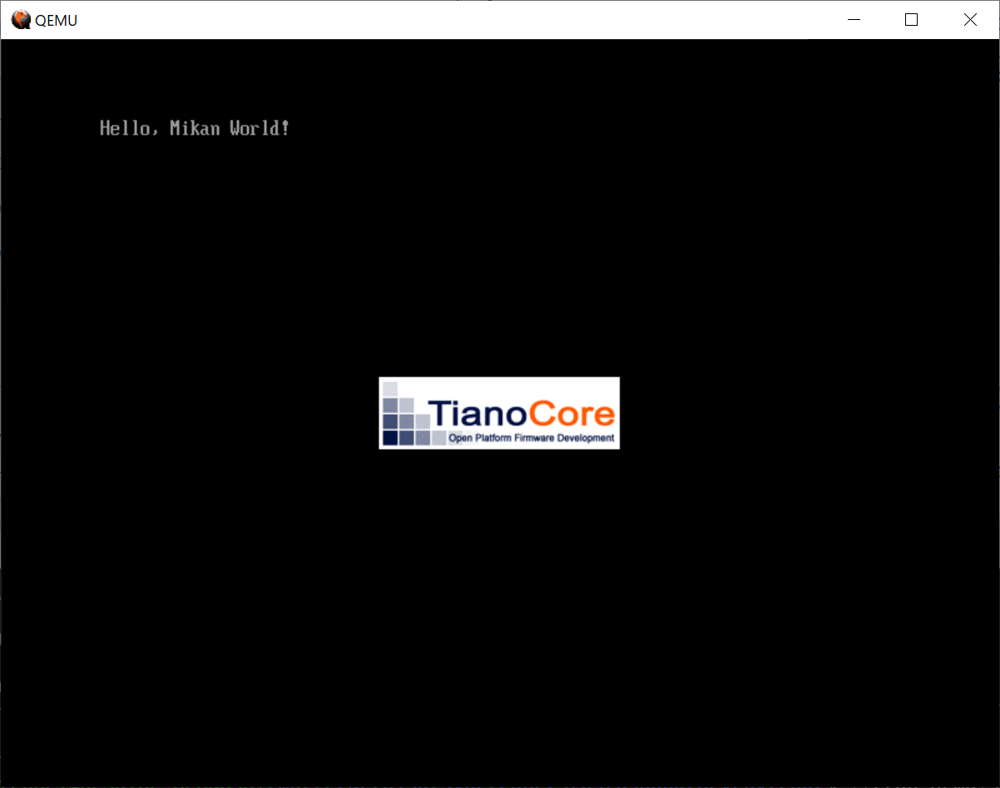

でた。

## 2021/05/04 （４日目）

`osbook_day02b`の`Main.c`を写経する。

`build`してQEMUを起動した。

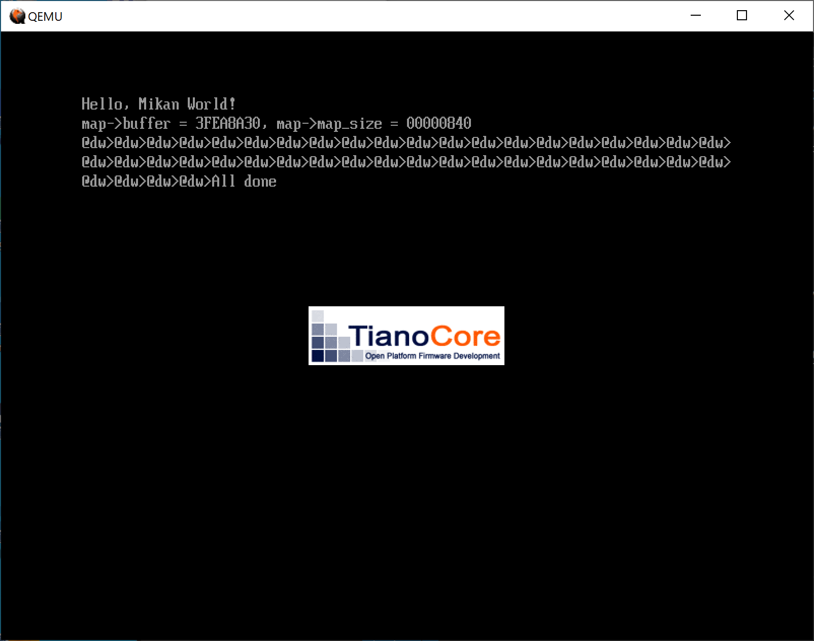

```sh
$ sudo mount -o loop disk.img mnt
$ cat mnt/memmap
Index, Type, Type(name), PhysicalStart, NumberOfPages, Attribute
@dw>@dw>@dw>@dw>@dw>@dw>@dw>@dw>@dw>@dw>@dw>@dw>@dw>@dw>@dw>@dw>@dw>@dw>@dw>@dw>@dw>@dw>@dw>@dw>@dw>@dw>@dw>@dw>@dw>@dw>@dw>@dw>@dw>@dw>@dw>@dw>@dw>@dw>@dw>@dw>@dw>@dw>@dw>@dw>
```

なんか出たけど、化けてる。。。

`Main.c`を見直したら、間違いが見つかった。
`len = AsciiSPrint(` が `len = AsciiPrint(` になっていた（`S`が抜けていた）。

[同じ間違いをしている人がいた](https://twitter.com/rsamodpq/status/1381268987124666371)。SがあるほうはNull終端するPrintらしいと、この人は分析している。

で、でた。


```sh
$ sudo mount -o loop disk.img mnt
$ cat mnt/memmap
Index, Type, Type(name), PhysicalStart, NumberOfPages, Attribute
0, 3, EfiBootServicesCode, 00000000, 1, F
1, 7, EfiConventionalMemory, 00001000, 9F, F
2, 7, EfiConventionalMemory, 00100000, 700, F
3, A, EfiACPIMemoryNVS, 00800000, 8, F
4, 7, EfiConventionalMemory, 00808000, 8, F
5, A, EfiACPIMemoryNVS, 00810000, F0, F
6, 4, EfiBootServicesData, 00900000, B00, F
7, 7, EfiConventionalMemory, 01400000, 3AB36, F
8, 4, EfiBootServicesData, 3BF36000, 20, F
9, 7, EfiConventionalMemory, 3BF56000, 270F, F
10, 1, EfiLoaderCode, 3E665000, 2, F
11, 4, EfiBootServicesData, 3E667000, 217, F
12, 3, EfiBootServicesCode, 3E87E000, B6, F
13, A, EfiACPIMemoryNVS, 3E934000, 12, F
14, 0, EfiReservedMemoryType, 3E946000, 1C, F
15, 3, EfiBootServicesCode, 3E962000, 10A, F
16, 6, EfiRuntimeServicesData, 3EA6C000, 5, F
17, 5, EfiRuntimeServicesCode, 3EA71000, 5, F
18, 6, EfiRuntimeServicesData, 3EA76000, 5, F
19, 5, EfiRuntimeServicesCode, 3EA7B000, 5, F
20, 6, EfiRuntimeServicesData, 3EA80000, 5, F
21, 5, EfiRuntimeServicesCode, 3EA85000, 7, F
22, 6, EfiRuntimeServicesData, 3EA8C000, 8F, F
23, 4, EfiBootServicesData, 3EB1B000, 4DA, F
24, 7, EfiConventionalMemory, 3EFF5000, 4, F
25, 4, EfiBootServicesData, 3EFF9000, 6, F
26, 7, EfiConventionalMemory, 3EFFF000, 1, F
27, 4, EfiBootServicesData, 3F000000, A1B, F
28, 7, EfiConventionalMemory, 3FA1B000, 1, F
29, 3, EfiBootServicesCode, 3FA1C000, 17F, F
30, 5, EfiRuntimeServicesCode, 3FB9B000, 30, F
31, 6, EfiRuntimeServicesData, 3FBCB000, 24, F
32, 0, EfiReservedMemoryType, 3FBEF000, 4, F
33, 9, EfiACPIReclaimMemory, 3FBF3000, 8, F
34, A, EfiACPIMemoryNVS, 3FBFB000, 4, F
35, 4, EfiBootServicesData, 3FBFF000, 201, F
36, 7, EfiConventionalMemory, 3FE00000, 8D, F
37, 4, EfiBootServicesData, 3FE8D000, 20, F
38, 3, EfiBootServicesCode, 3FEAD000, 20, F
39, 4, EfiBootServicesData, 3FECD000, 9, F
40, 3, EfiBootServicesCode, 3FED6000, 1E, F
41, 6, EfiRuntimeServicesData, 3FEF4000, 84, F
42, A, EfiACPIMemoryNVS, 3FF78000, 88, F
43, 6, EfiRuntimeServicesData, FFC00000, 400, 1
```

## 2021/05/05 （5日目）

3章。

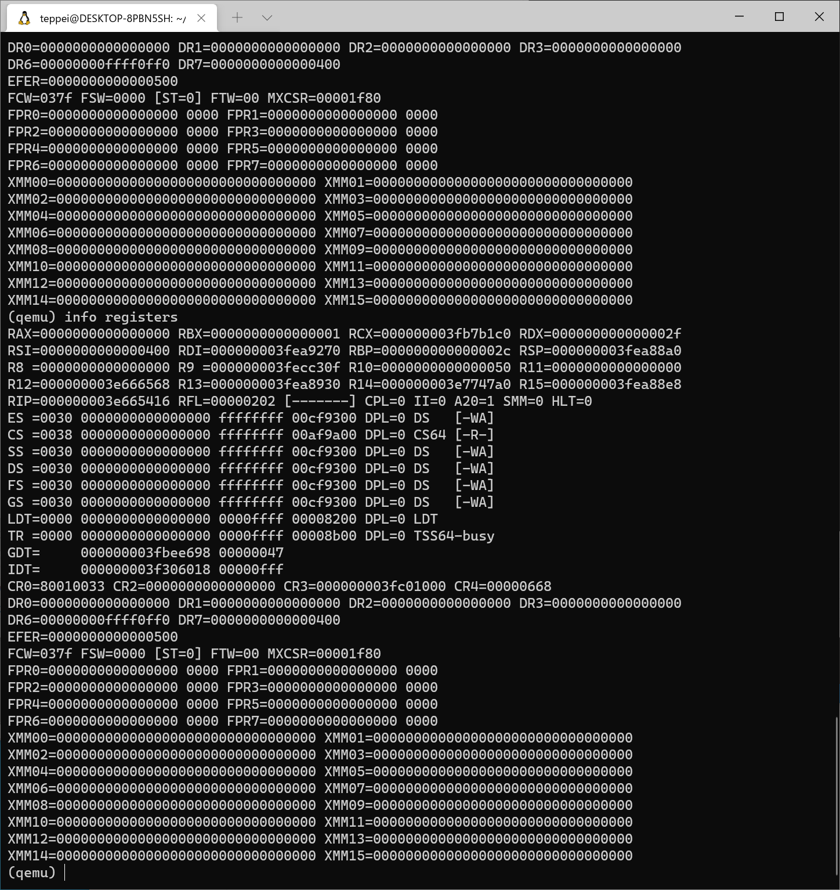

なんかでた。

QEMU起動直後と、while(1)で止まっているときと、でレジスタの値が変わってる。デバッグしてる感じ。

```
(qemu) info registers
RAX=0000000000000000 RBX=0000000000000001 RCX=000000003fb7b1c0 RDX=0000000000000002
RSI=0000000000000400 RDI=000000003fea9270 RBP=000000000000002c RSP=000000003fea88a0
R8 =00000000000000af R9 =0000000000000288 R10=0000000000000050 R11=0000000000000000
R12=000000003e666568 R13=000000003fea8930 R14=000000003e7747a0 R15=000000003fea88e8
RIP=000000003e665416 RFL=00000202 [-------] CPL=0 II=0 A20=1 SMM=0 HLT=0
ES =0030 0000000000000000 ffffffff 00cf9300 DPL=0 DS   [-WA]
CS =0038 0000000000000000 ffffffff 00af9a00 DPL=0 CS64 [-R-]
SS =0030 0000000000000000 ffffffff 00cf9300 DPL=0 DS   [-WA]
DS =0030 0000000000000000 ffffffff 00cf9300 DPL=0 DS   [-WA]
FS =0030 0000000000000000 ffffffff 00cf9300 DPL=0 DS   [-WA]
GS =0030 0000000000000000 ffffffff 00cf9300 DPL=0 DS   [-WA]
LDT=0000 0000000000000000 0000ffff 00008200 DPL=0 LDT
TR =0000 0000000000000000 0000ffff 00008b00 DPL=0 TSS64-busy
GDT=     000000003fbee698 00000047
IDT=     000000003f306018 00000fff
CR0=80010033 CR2=0000000000000000 CR3=000000003fc01000 CR4=00000668
DR0=0000000000000000 DR1=0000000000000000 DR2=0000000000000000 DR3=0000000000000000
DR6=00000000ffff0ff0 DR7=0000000000000400
EFER=0000000000000500
FCW=037f FSW=0000 [ST=0] FTW=00 MXCSR=00001f80
FPR0=0000000000000000 0000 FPR1=0000000000000000 0000
FPR2=0000000000000000 0000 FPR3=0000000000000000 0000
FPR4=0000000000000000 0000 FPR5=0000000000000000 0000
FPR6=0000000000000000 0000 FPR7=0000000000000000 0000
XMM00=00000000000000000000000000000000 XMM01=00000000000000000000000000000000
XMM02=00000000000000000000000000000000 XMM03=00000000000000000000000000000000
XMM04=00000000000000000000000000000000 XMM05=00000000000000000000000000000000
XMM06=00000000000000000000000000000000 XMM07=00000000000000000000000000000000
XMM08=00000000000000000000000000000000 XMM09=00000000000000000000000000000000
XMM10=00000000000000000000000000000000 XMM11=00000000000000000000000000000000
XMM12=00000000000000000000000000000000 XMM13=00000000000000000000000000000000
XMM14=00000000000000000000000000000000 XMM15=00000000000000000000000000000000
```

本の手順にしたがって、`RIP`のアドレスのところを見てみる。

```
(qemu) x /4xb 0x000000003e665416
000000003e665416: 0xeb 0xfe 0x55 0x41
(qemu) x /4ib 0x000000003e665416
0x000000003e665416:  jmp    0x3e665416
0x000000003e665418:  push   %rbp
0x000000003e665419:  push   %r15
0x000000003e66541b:  push   %r14
```

`jmp`で同じアドレスに飛んでる。`while (1);`のところっぽい。

次は、カーネルを作る作業に移る。

`day03/kernel/main.cpp`に3.3節のソースコードを写経する。

`day03/kernel/Makefile`を作ってコンパイル手順を残しておく。

## 2021/05/06 （6日目）

30日では終わらなそう。

昨日作った`kernel.elf`を`readelf`で覗いてみる。

```sh
$ readelf kernel.elf
ELF Header:
  Magic:   7f 45 4c 46 02 01 01 00 00 00 00 00 00 00 00 00 
  Class:                             ELF64
  Data:                              2's complement, little endian
  Version:                           1 (current)
  OS/ABI:                            UNIX - System V
  ABI Version:                       0
  Type:                              EXEC (Executable file)
  Machine:                           Advanced Micro Devices X86-64
  Version:                           0x1
  Entry point address:               0x101000
  Start of program headers:          64 (bytes into file)
  Start of section headers:          8928 (bytes into file)
  Flags:                             0x0
  Size of this header:               64 (bytes)
  Size of program headers:           56 (bytes)
  Number of program headers:         4
  Size of section headers:           64 (bytes)
  Number of section headers:         14
  Section header string table index: 12
```

```sh
$ cd MikanOS/day03a
$ ./bat.sh
$ ../../osbook/devenv/run_qemu.sh ../../edk2/Build/MikanLoaderX64/DEBUG_CLANG38/X64/Loader.efi kernel/kernel.elf
```

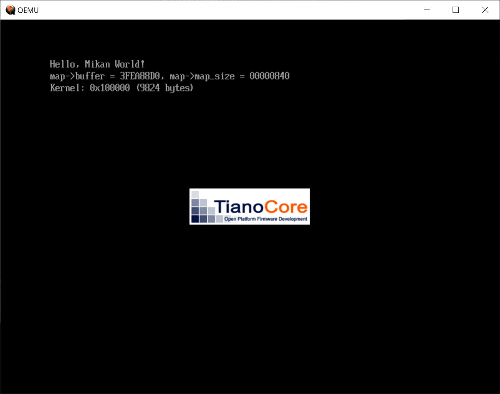

とりあえず`kernel.elf`を読み込んで実行できてそう。

```
(qemu) info registers
RAX=0000000000100000 RBX=000000003effef18 RCX=0000000000000000 RDX=0000000000000000
RSI=000000003feaca08 RDI=000000003feac9e0 RBP=000000003fea8850 RSP=000000003fea8850
R8 =000000003fea87c4 R9 =000000003fb7b48f R10=000000003fbcd018 R11=fffffffffffffffc
R12=000000003effe920 R13=000000003feac8d0 R14=000000003fea9110 R15=000000003e66573c
RIP=0000000000101011 RFL=00000046 [---Z-P-] CPL=0 II=0 A20=1 SMM=0 HLT=1
ES =0030 0000000000000000 ffffffff 00cf9300 DPL=0 DS   [-WA]
CS =0038 0000000000000000 ffffffff 00af9a00 DPL=0 CS64 [-R-]
SS =0030 0000000000000000 ffffffff 00cf9300 DPL=0 DS   [-WA]
DS =0030 0000000000000000 ffffffff 00cf9300 DPL=0 DS   [-WA]
FS =0030 0000000000000000 ffffffff 00cf9300 DPL=0 DS   [-WA]
GS =0030 0000000000000000 ffffffff 00cf9300 DPL=0 DS   [-WA]
LDT=0000 0000000000000000 0000ffff 00008200 DPL=0 LDT
TR =0000 0000000000000000 0000ffff 00008b00 DPL=0 TSS64-busy
GDT=     000000003fbee698 00000047
IDT=     000000003f306018 00000fff
CR0=80010033 CR2=0000000000000000 CR3=000000003fc01000 CR4=00000668
DR0=0000000000000000 DR1=0000000000000000 DR2=0000000000000000 DR3=0000000000000000 
DR6=00000000ffff0ff0 DR7=0000000000000400
EFER=0000000000000500
FCW=037f FSW=0000 [ST=0] FTW=00 MXCSR=00001f80
FPR0=0000000000000000 0000 FPR1=0000000000000000 0000
FPR2=0000000000000000 0000 FPR3=0000000000000000 0000
FPR4=0000000000000000 0000 FPR5=0000000000000000 0000
FPR6=0000000000000000 0000 FPR7=0000000000000000 0000
XMM00=00000000000000000000000000000000 XMM01=00000000000000000000000000000000
XMM02=00000000000000000000000000000000 XMM03=00000000000000000000000000000000
XMM04=00000000000000000000000000000000 XMM05=00000000000000000000000000000000
XMM06=00000000000000000000000000000000 XMM07=00000000000000000000000000000000
XMM08=00000000000000000000000000000000 XMM09=00000000000000000000000000000000
XMM10=00000000000000000000000000000000 XMM11=00000000000000000000000000000000
XMM12=00000000000000000000000000000000 XMM13=00000000000000000000000000000000
XMM14=00000000000000000000000000000000 XMM15=00000000000000000000000000000000
```

`RIP=0000000000101011` なので、このアドレスの命令を見てみる。

```
(qemu) x /2i 0x101011
0x0000000000101011:  jmp    0x101010
0x0000000000101013:  int3   
(qemu) x /2i 0x101010
0x0000000000101010:  hlt    
0x0000000000101011:  jmp    0x101010
```

で`hlt`になってた。
`hlt`の次の行の`jmp 0x101010`は、`main.cpp`の`while (1)`のことのようだ。

```cpp:main.cpp
extern "C" void KernelMain() {
    while (1) __asm__("hlt");
}
```

## 2021/05/07 （7日目）

今日は3.4節から。

`Main.c`に`OpenGOP`、`GetPixelFormatUnicode`の関数を追加、`UefiMain`に`gop`を使う命令を追加した。

```sh
$ cd day03b
$ cd kernel; make; cd ..
$ ./bat.sh
$ ../../osbook/devenv/run_qemu.sh ../../edk2/Build/MikanLoaderX64/DEBUG_CLANG38/X64/Loader.efi kernel/kernel.elf
```

でた！

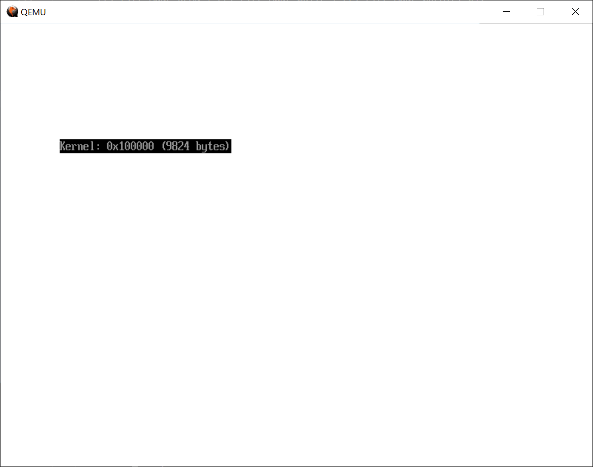

白く塗りつぶしてしまって、画面の解像度情報とかが見えなくなってるので、塗りつぶさないようにしてみた。

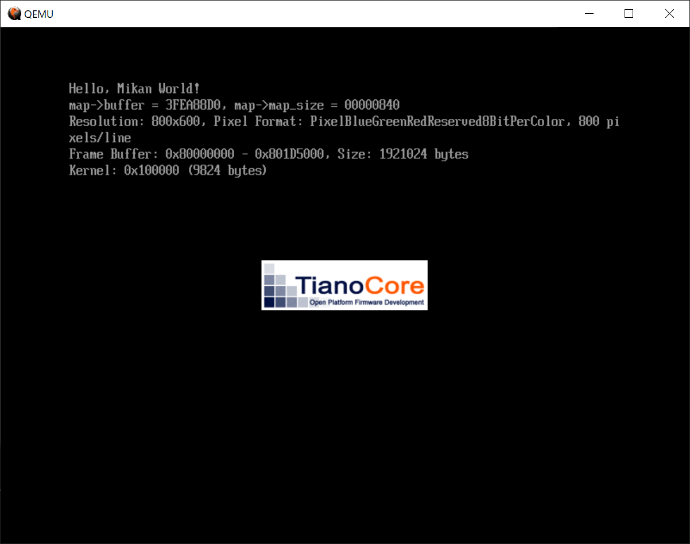

- 解像度は800x600 （1行に800画素）
- BGR
- フレームバッファは0x80000000～0x801D5000で、サイズは1,921,024バイト
  - 800x600x4バイト=1,920,000バイト
  - 1ページ4096バイト単位だから切り上げて、1,921,024 (=int((1,920,000+0xFFF)/0x1000)*0x1000)

## 2021/05/08 （8日目）

今日は`osbook_day03c`のところ。

`kernel/main.cpp`を改造する。

```sh
$ cd day03c
$ source ../../osbook/devenv/buildenv.sh
```

`source`している`buildenv.sh`の中身を一応見ておくと、`CPPFLAGS`と`LDFLAGS`が環境変数として宣言されていた。

```sh
$ cat ../../osbook/devenv/buildenv.sh 
# Usage: source buildenv.sh

BASEDIR="$HOME/osbook/devenv/x86_64-elf"
EDK2DIR="$HOME/edk2"
export CPPFLAGS="\
-I$BASEDIR/include/c++/v1 -I$BASEDIR/include -I$BASEDIR/include/freetype2 \
-I$EDK2DIR/MdePkg/Include -I$EDK2DIR/MdePkg/Include/X64 \
-nostdlibinc -D__ELF__ -D_LDBL_EQ_DBL -D_GNU_SOURCE -D_POSIX_TIMERS \
-DEFIAPI='__attribute__((ms_abi))'"
export LDFLAGS="-L$BASEDIR/lib"
```

この環境変数を使うように`Makefile`を書き換えておく。

```Makefile
all: main.cpp
	clang++ $(CPPFLAGS) -O2 -Wall -g --target=x86_64-elf -ffreestanding -mno-red-zone -fno-exceptions -fno-rtti -std=c++17 -c main.cpp
	ld.lld $(LDFLAGS) --entry KernelMain -z norelro --image-base 0x100000 --static -o kernel.elf main.o
```

```sh
$ cd day03c
$ ./bat.sh
$ ../../osbook/devenv/run_qemu.sh ../../edk2/Build/MikanLoaderX64/DEBUG_CLANG38/X64/Loader.efi kernel/kernel.elf
```

でた。

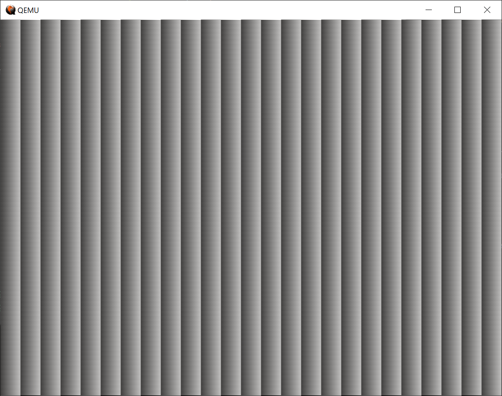

## 2021/05/09 （9日目）

今日は3.6節から。エラー処理の追加。

```sh
$ cd day03d
$ source ../../osbook/devenv/buildenv.sh
$ (cd kernel; make)
$ ./bat.sh
$ ../../osbook/devenv/run_qemu.sh ../../edk2/Build/MikanLoaderX64/DEBUG_CLANG38/X64/Loader.efi kernel/kernel.elf
```

エラー処理の追加だけだから、変化なし。

故意にエラーを出してみたいけど、ちょっと今回は飛ばす。そのうち出るでしょう。

## 2021/05/10 （10日目）

今日は4.1節から。

`.PHONY`を書いたことなかった。。。

すでに`kernel`に`Makefile`を書いてたけど、書き直した。→ `day04a`


`day04b` を編集して、

```sh
$ cd day04b
$ source ../../osbook/devenv/buildenv.sh
$ (cd kernel; make)
$ ./bat.sh
$ ../../osbook/devenv/run_qemu.sh ../../edk2/Build/MikanLoaderX64/DEBUG_CLANG38/X64/Loader.efi kernel/kernel.elf
```

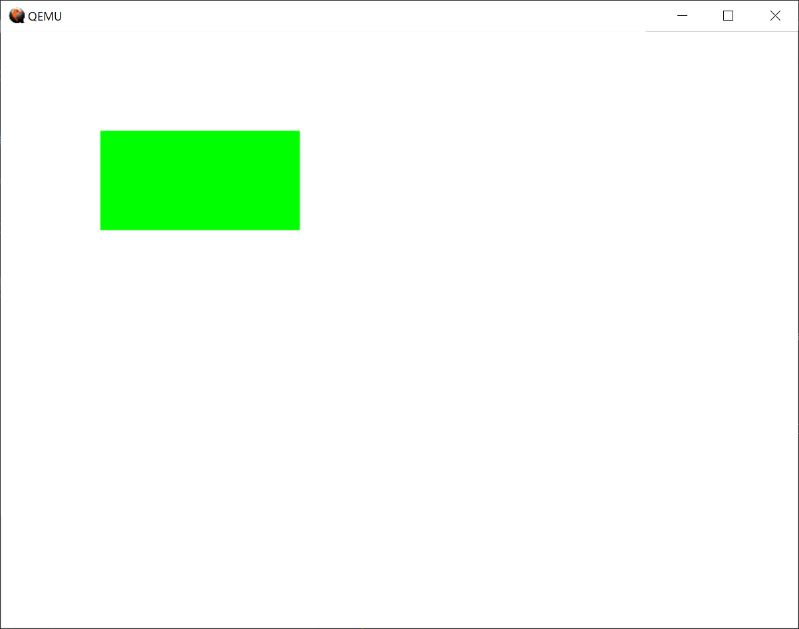

緑の四角が描けた。

他の色で四角が描けるか試すために`kernel/main.cpp`に下記を追加した。

```cpp
    for (int x = 0; x < 100; ++x)
    {
        for (int y = 0; y < 100; ++y)
        {
            WritePixel(frame_buffer_config, 300 + x, 120 + y, {255, 0, 0});
        }
    }

    for (int x = 0; x < 50; ++x)
    {
        for (int y = 0; y < 100; ++y)
        {
            WritePixel(frame_buffer_config, 450 + x, 240 + y, {0, 0, 255});
        }
    }
```


うまく描けた。

## 2021/05/11 （11日目）

今日は4.3節から。

配置newのことを初めて知った。
普段何気なく使っているヒープ領域はOSがあって初めて利用できる領域ということも知らなかった。
確かにメモリ領域の確保や解放は、空き領域を探したり再利用できるようにする仕組みがないと使えない。なるほど。

今日は`kernel/main.cpp`を編集した。

```sh
$ cd day04c
$ source ../../osbook/devenv/buildenv.sh
$ (cd kernel; make)
$ ./bat.sh
$ ../../osbook/devenv/run_qemu.sh ../../edk2/Build/MikanLoaderX64/DEBUG_CLANG38/X64/Loader.efi kernel/kernel.elf
```

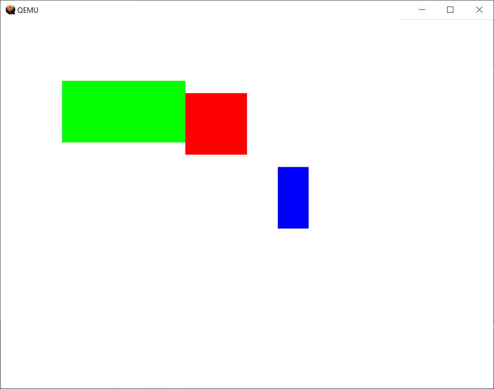

## 2021/05/12 （12日目）

今日は4.5節から。

```sh
$ readelf -l kernel.elf

Elf file type is EXEC (Executable file)
Entry point 0x101020
There are 5 program headers, starting at offset 64

Program Headers:
  Type           Offset             VirtAddr           PhysAddr
                 FileSiz            MemSiz              Flags  Align
  PHDR           0x0000000000000040 0x0000000000100040 0x0000000000100040
                 0x0000000000000118 0x0000000000000118  R      0x8
  LOAD           0x0000000000000000 0x0000000000100000 0x0000000000100000
                 0x00000000000001a8 0x00000000000001a8  R      0x1000
  LOAD           0x0000000000001000 0x0000000000101000 0x0000000000101000
                 0x0000000000000259 0x0000000000000259  R E    0x1000
  LOAD           0x0000000000002000 0x0000000000102000 0x0000000000102000
                 0x0000000000000000 0x0000000000000018  RW     0x1000
  GNU_STACK      0x0000000000000000 0x0000000000000000 0x0000000000000000
                 0x0000000000000000 0x0000000000000000  RW     0x0

 Section to Segment mapping:
  Segment Sections...
   00     
   01     .rodata 
   02     .text 
   03     .bss 
   04     
```

`Main.c`で新しく追加した関数は、ヘッダファイルの中のアドレスを見て、使いたい領域のアドレスまでジャンプする処理になっている。
データ構造の設計がうまくいっているからこのように実装できるんだろうけど、ちょっと考えないとついていけなくなる。

```sh
$ cd day04d
$ source ../../osbook/devenv/buildenv.sh
$ (cd kernel; make)
$ ./bat.sh
$ ../../osbook/devenv/run_qemu.sh ../../edk2/Build/MikanLoaderX64/DEBUG_CLANG38/X64/Loader.efi kernel/kernel.elf
```


画面に代り映えがないけど、出た。

## 2021/05/13 （13日目）

今日は5.1節から。

`A`を1度っとずつ描くのは楽しい。

本と違って3つ出るようにした。

```cpp
    WriteAscii(*pixel_writer, 50, 50, 'A', {0, 0, 0});
    WriteAscii(*pixel_writer, 58, 50, 'A', {0, 0, 0});
    WriteAscii(*pixel_writer, 58, 66, 'A', {0, 0, 0});
```

```sh
$ cd day05a
$ source ../../osbook/devenv/buildenv.sh
$ (cd kernel; make)
$ ./bat.sh
$ ../../osbook/devenv/run_qemu.sh ../../edk2/Build/MikanLoaderX64/DEBUG_CLANG38/X64/Loader.efi kernel/kernel.elf
```


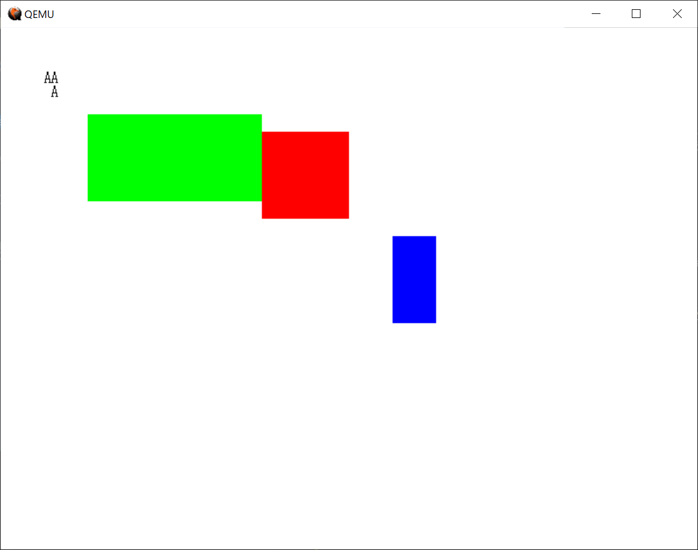

`A`がでた！


## 2021/05/14 （14日目）

今日は5.2節から。

分割コンパイルできるように`main.cpp`の一部を`font.cpp/hpp`と`graphics.cpp/hpp`に分割した。
`.gitignore`も追加した。`mikanos`のリポジトリでは`kernel`の中に置いていたけど、`./bat.sh`で作られる`disk.img`も除外できるように、一つ上のディレクトリに置いて除外候補に追加した。

```sh
$ cd day05b
$ source ../../osbook/devenv/buildenv.sh
$ (cd kernel; make)
$ ./bat.sh
$ ../../osbook/devenv/run_qemu.sh ../../edk2/Build/MikanLoaderX64/DEBUG_CLANG38/X64/Loader.efi kernel/kernel.elf
```

ソースコードを分割しただけなので、昨日と同じ結果だけど、出た。


次は5.3節。

フォントデータは下記のところから取ってきたもののようだ。

http://openlab.ring.gr.jp/efont/dist/shinonome/shinonome-0.9.11-src.tar.bz2

`hankaku/font_src.bit` が元データのようだけど、並び替えとか前処理が必要そう。
今回はmikanosのリポジトリにおいてある処理済みの`kernel/henkaku.txt`を使う。

```Makefile
hankaku.bin: hankaku.txt
	../tools/makefont.py -o $@ $<

hankaku.o: hankaku.bin
	objcopy -I binary -O elf64-x86-64 -B i386:x86-64 $< $@
```

この操作でできた`henkaku.o`を`objdump`で見てみた。

```sh
$ objdump -t hankaku.o

hankaku.o:     file format elf64-x86-64

SYMBOL TABLE:
0000000000000000 l    d  .data  0000000000000000 .data
0000000000000000 g       .data  0000000000000000 _binary_hankaku_bin_start
0000000000001000 g       .data  0000000000000000 _binary_hankaku_bin_end
0000000000001000 g       *ABS*  0000000000000000 _binary_hankaku_bin_size
```

`objcopy`で上のようなシンボルテーブルが作られたようだ。

Pythonスクリプト`tools/makefont.py`は、`henkaku.txt`内の`.`と`@`がある行を見つけ、それをそのまま1バイトの数字に置き換える処理をしていた。
256文字で1文字あたり16バイトなので、フォントデータは全部で256*16=4096=0x1000バイト。

`kernel/font.cpp`の`GetFont()`では、文字コードに16を掛けて`index`を求め、`_binary_hankaku_bin_start`からのオフセットとして計算し、フォントデータのアドレスを求める。

なるほど。

シンボルテーブルを作ってリンクしてしまえば、バイナリデータを直接使えるようになるってことか。
バイナリファイルを`xxd -i`でヘッダファイルに変換して使ったことがあったけど。このやり方でもたぶん行ける。
後者のやり方だと、ファイルが大きくなってしまうけど。

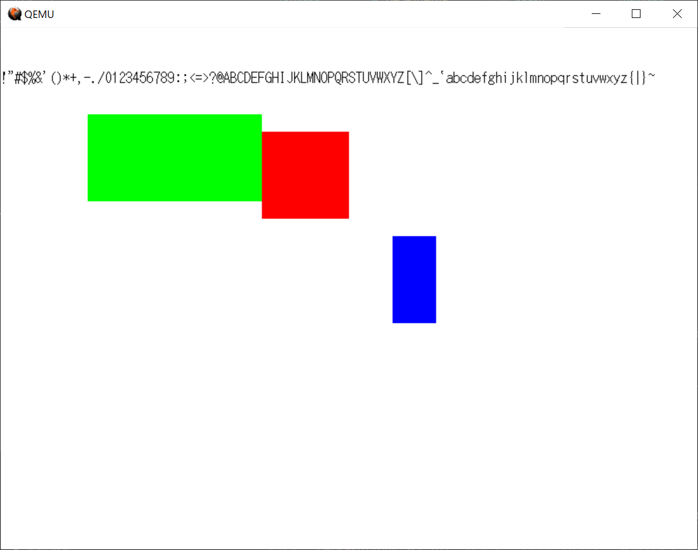

出た。


## 2021/05/15 （15日目）

今日は5.4節から。文字列の描画。

実装は簡単だった。けど、`newlib_support.c`が謎。もう少し増えてきたらちょっと調査してみたい。

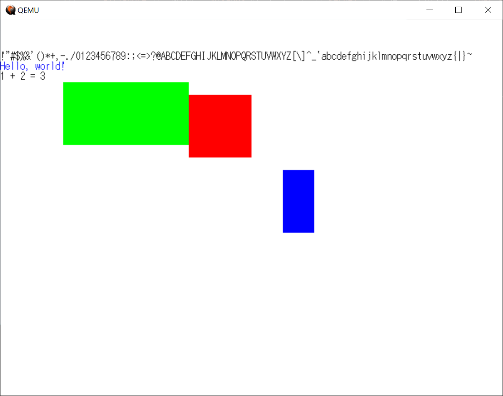

とりあえず出た。

続いて、5.5節。


テキストが流れるような動きが出ると、なんかインタラクティブなシステムを作ってるんだなと実感がわく。

27行とケチケチせずに、0x1000行出すようにしてみた。

```cpp
    char buf[128];
    for (int i=0; i<0x1000; ++i){
        sprintf(buf, "line %d\n", i);
        console.PutString(buf);
    }
```

ちらつきながらかなり時間を要して4095番目まで表示した。

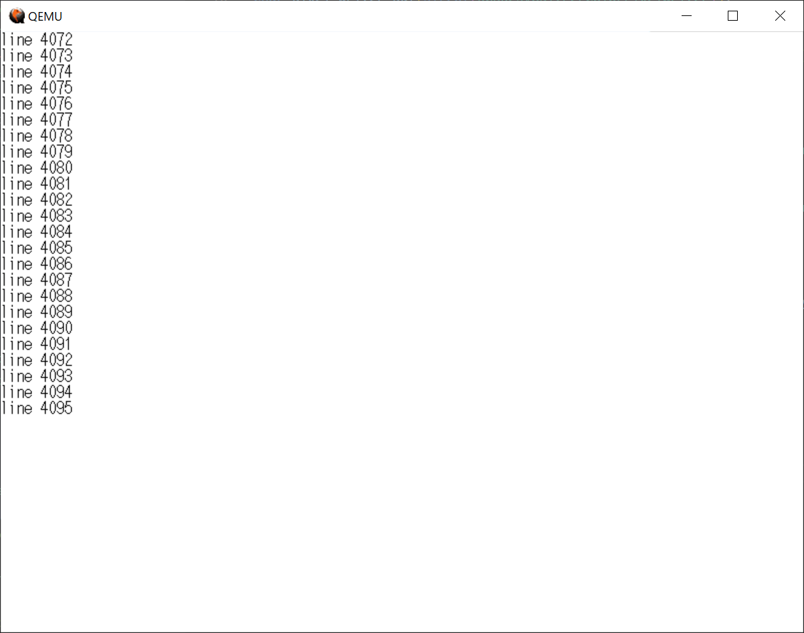

さらに続けて5.6節。


出せた。

## 2021/05/16 （16日目）

今日から６章。OSに入力手段を実装する章。

6.1節はOSっぽい画面の表示。

動かせないけどカーソルが出てくるとGUIっぽさが出てくる。

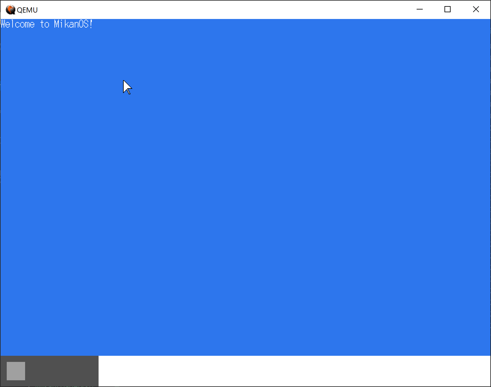

## 2021/05/17 （17日目）

昨日6.2節を読んだ後、USBドライバのソースコードを覗いてみた。
USBの仕様書を片手に読まないとわからない感じだった。
一通り読み終わって余力があったら解析してみたいなあ。

今日は6.3節から。
接続されているPCIデバイスを列挙する。

今日は今までより写経の分量が多かった。

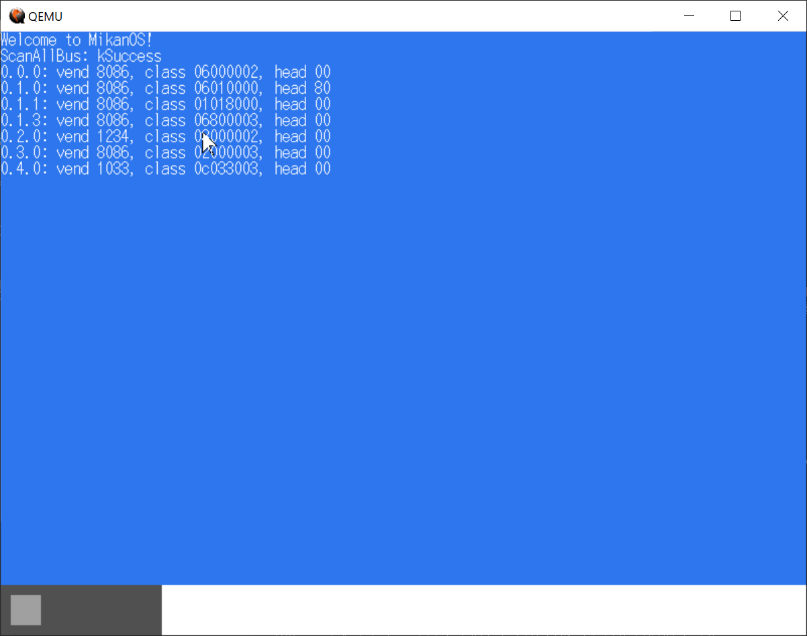

PCIデバイスを画面に列挙できた。これらが何かは明日以降調べよう。。。

## 2021/05/18 （18日目）

今日は6.4節。マウスカーソルが動くようになる。

今回の写経の量が多すぎて疲れた。

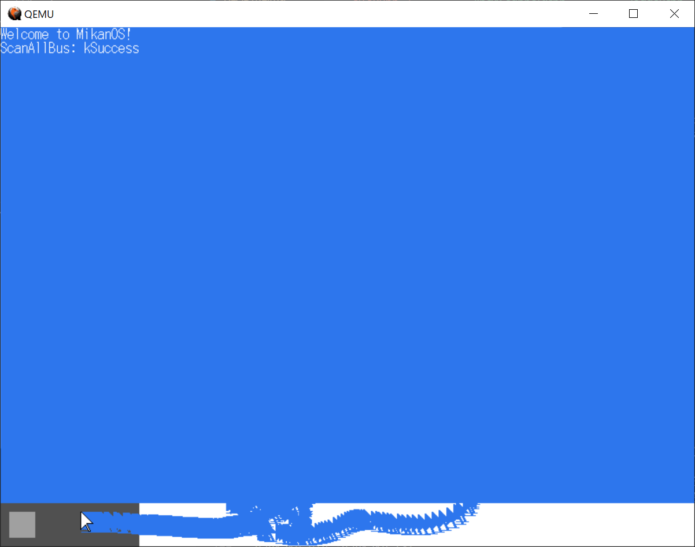

とりあえず動いた。

過去に実装した関数にも手が入っていて、修正漏れがたくさん出てしまった。
特に`pci.cpp`と`pci.hpp`で、戻り値の`Error`の定義を変えてしまってて、ほぼすべての関数に手が入ってた。

入力装置が使えるようになったのは進歩を実感した。
ただ肝になる部分であるUSBドライバがよくわかってないので、ちょっと気持ち悪い気もする。

## 2021/05/19 （19日目）

昨日の6.4節のところを無心に写経したもんで、ほとんど記憶に残ってない。
ちょっと復習してみる。

6.3節のPCIのところから分かってなかった。

PCに接続されているPCIを列挙することを考える。
そのためにはPCIコンフィグレーション空間（142ページ図6.3）を読んでくればいい。

ここを読むためには、IOアドレス空間の0x0CF8のCONFIG_ADDRESSレジスタと、
0x0CFCにあるCONFIG_DATAレジスタを使う。

CONFIG_ADDRESSレジスタは、[31:0]の変数になっていて、
- [31] Enableビット。1にするとCONFIG_DATAでPCIコンフィグレーション空間を読み書きできる
- [30:24] 予約領域。0に設定する
- [23:16] バス番号（0-255）
- [15:11] デバイス番号（0-31）
- [10:8] ファンクション番号（0-7）
- [7:0] レジスタオフセット（0-255）。4バイト単位のオフセットを指定する

CONFIG_ADDRESSを作る為の関数が`MakeAddress()`。
Enableビットが1になるようになっているため、この関数で作った値でCONFIG_ADDRESSレジスタにアクセスすると、CONFIG_DATAからデータを読むことができる。

- `Vendor ID`を読むのが`ReadVendorId()`
- `Device ID`を読むのが`ReadDeviceId()`
- `Header Type`を読むのが`ReadHeaderType()`
- `Base Class`, `Sub Class`, `Interface`の3つをまとめて読むのが`ReadClassCode()`

など。
中でやっているのは、CONFIG_ADDRESSに値を設定して、CONFIG_DATAで読みだした値をビット演算で切り出しているだけ。

よくわからないのが、`ScanAllBus()`でやっていること。
おそらくPCIバスがどういう接続を想定してるのかが分からないからだと思う。

いい記事が見つからなかったけど、[このOracleの記事](https://docs.oracle.com/cd/E38900_01/html/E38872/hwovr-25520.html)の図A-3でなんとなく分かった。

始めは、CPUに存在するすべてのバスが直接つながっているのかと思っていた。だからよくわからなかった。

本当は、CPUに直接つながっているのはPCIホストブリッジで、バス0にはそのブリッジを介して接続する。バス0以外のバスはPCIバスブリッジを介して接続する、という階層構造になっていた。

149ページのリスト6.15で、ベースクラス0x06・サブクラス0x04であるPCIブリッジを探索し、`Base Address Register 2`を読み出していた。
なんでそんなことしているのか？と思ってたけど、そこは下位の階層のバス番号が書いてあって、それを使ってそのバスにつながっている機器を探索する。という作りになっていた。

これで6.3節でやっていることが分かった。

明日は6.4節を復習しよう。

## 2021/05/20 （20日目）

今日は6.4節の復習。

6.3節が分かれば、xHCを探すところはすぐわかる。
`ScanAllBus()`で探索した`devices`を一つずつ取り出して、クラスコードが0x0c,0x03,0x30のものを見つける。
そういえば、見つからなかった時のエラー処理は入れてないみたい。

Base Address Registerは`CalcBarAddress()`で計算する。
PCIコンフィグレーション空間の0x10から始まっているから、`bar_index`をオフセットにして求めるのは分かるけど、
`ReadConfReg()`で取り出した`bar`の2ビット目（`(bar & 4u)`してるとこ）が、0だったら32bitだと思ってそのまま終わって、
そうでないときは64bitだと思ってさらに32bit読んで連結している。

どういう仕様？特に書いてないなあ。

`SwitchEhci2Xhci()`を実装した経緯をまとめているあたり、デバイスドライバを書く人の苦労を感じる。
これまでハードウェア設計して来で、レジスタ仕様を決めると、ソフト書く人大変そうだなあ、と思うことがたまにあった。
Linuxに先達が調べて実装した成果が残ってたからいいけど（それを見つけるだけでも大変だけど）、適当な仕様書からソフトを起こすのは大変そうだなあ。

`usb::HIDMouseDriver::default_observer`にマウスが動作したときのコールバック関数を登録している。

この作りだとマウスが2個以上接続されていても、それぞれの動きを検出して動くようになってそう。
ちょうどいま2個マウスが接続されているけど、いまはQEMUで動作確認しているから、ホストOSが2個のマウスに対応しているのか、ゲストOSが対応しているのか見分けがつかないなあ。


明日から7章に取り掛かる。

## 2021/05/21 （21日目）

今日から7章。

x86-64での割り込みはちょっと書くことが多くて複雑そう。
たまに使ってるArduinoだと、下記のように[`attachInterrupt()`で関数を登録する](https://www.arduino.cc/reference/en/language/functions/external-interrupts/attachinterrupt/)だけだった。

```cpp
const byte ledPin = 13;
const byte interruptPin = 2;
volatile byte state = LOW;

void setup() {
  pinMode(ledPin, OUTPUT);
  pinMode(interruptPin, INPUT_PULLUP);
  attachInterrupt(digitalPinToInterrupt(interruptPin), blink, CHANGE);
}

void loop() {
  digitalWrite(ledPin, state);
}

void blink() {
  state = !state;
}
```

使っているマイコンで割り込みを設定するのにはもう少し手続きが必要っぽいけど、Arduinoのライブラリを使っていれば結構簡単に使える。
ハードウェアの制約に気を付ける必要はあるけど。

## 2021/05/22 （22日目）

昨日は途中で止めてしまったので、今日はきりの良い7.6節まで読んで写経を開始する。

あまり理解せずに無心で写経してしまった。

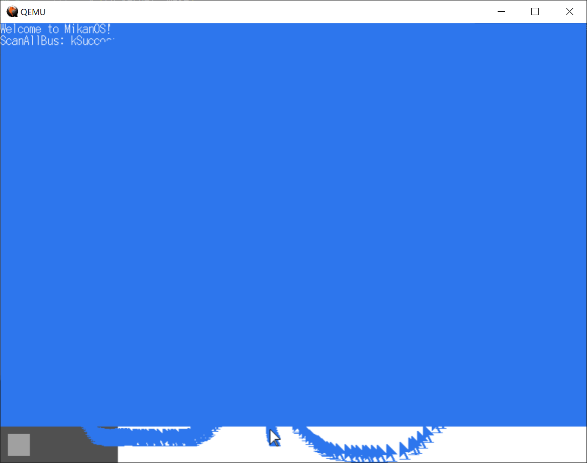

一応ちゃんと動いた。

MSIに関して本文であまり解説がなかったけど、コード量はかなりあった。
基本的な仕様は書いてあるので、読み解けそう。


## 2021/05/23 （23日目）

7.5節を復習。

PCIデバイスのIRQ設定で苦労してたことがよみがえってきた。

ディップスイッチでどの割り込みにするかを決める必要があった。
初めてSCSIのHDDを買って、拡張ボードを組み込むとき何をどう決めればいいのか分からず戸惑った記憶がある。

確かにある時期からこの設定をしなくてよくなった。あまりその辺の事情を知らずに使っていたんだなあ。

2000年ごろに買って本棚に入れっぱなしにしてたPCIデバイス設計関連の書籍があって、
ちょっと眺めてみたら確かにINT A#～D#の4本の割り込み信号を共有することが書いてあった。

さて。

`CapabilityHeader()`とか`MSICapability()`とかが分からな過ぎてつらい。

`ReadCapabilityHeader()`の使い方を追ってみると、PCIコンフィグレーション空間の(p.142 図6.3)0x34の下位8bitを見ていた。

```cpp
    Error ConfigureMSI(const Device &dev,
                       uint32_t msg_addr,
                       uint32_t msg_data,
                       unsigned int num_vector_exponent)
    {
        uint8_t cap_addr = ReadConfReg(dev, 0x34) & 0xffu;
        uint8_t msi_cap_addr = 0;
        uint8_t msix_cap_addr = 0;
        while (cap_addr != 0)
        {
            auto header = ReadCapabilityHeader(dev, cap_addr)
```


`Capabilities Pointer`なるものが格納されていた。
ここに格納されている8bitのアドレスを使って、さらにPCIコンフィグレーション空間を探索していた。

処理途中をダンプしてみた。

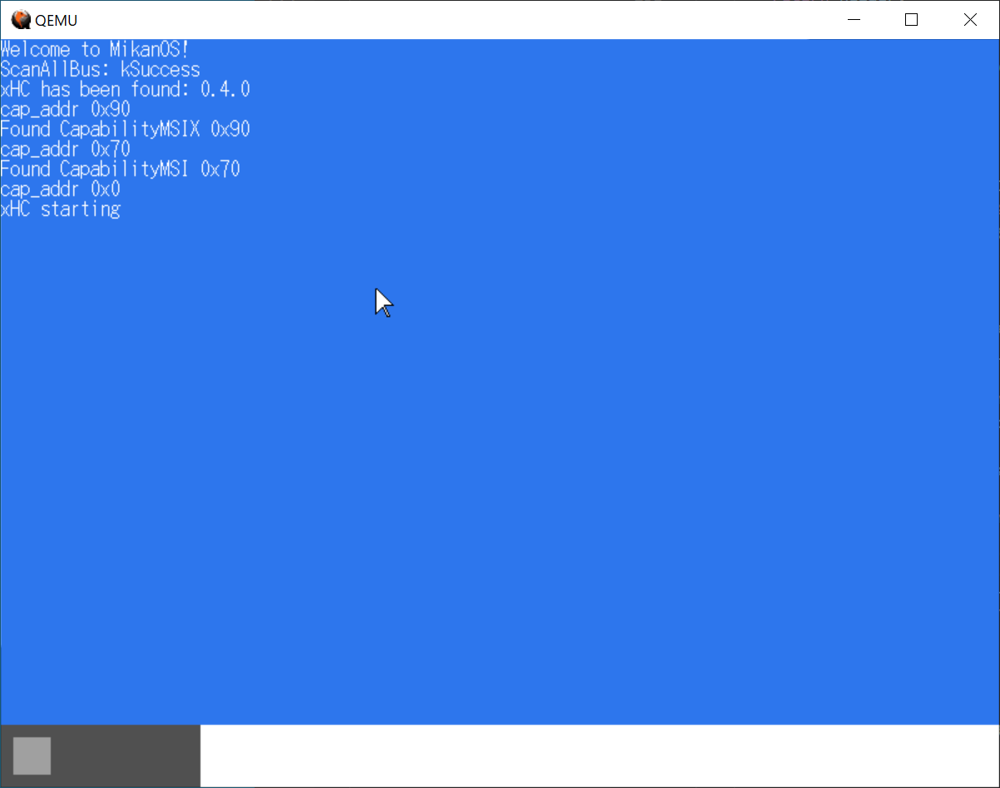

`next_ptr`を順にたどって、
0x90にCapabilityMSIXが、
0x70にCapabilityMSIがみつかった。

その見つかったアドレスを使って、`ConfigureMSIRegister()`で、
p.169で説明されたMessage AddressレジスタとMessage Dataレジスタを設定する、と。


## 2021/05/24 （24日目）

今日は7.7節から。

リングバッファを用意してそれをQueueとして使い、割り込み情報を一時保管する場として使うようにする改造。

無心に写経した。

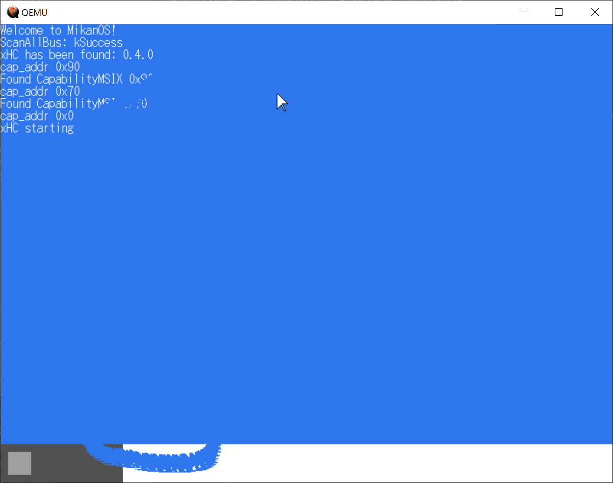

出た。

Queueに保存するのは、何で割り込みが入ったか、という情報だけで、
肝心の送られてきたデータ自体は後で`ProcessEvent(xhc)`で処理するようになっている。

中身を追ってみたけどちょっとよくわからなかったが、
少なくとも`__asm__("cli")`と`__asm__("sti")`との間の割り込み禁止期間の外側なので、
マウスカーソルの描画処理の最中に追加で割り込みが来ても、無視されることはない。

