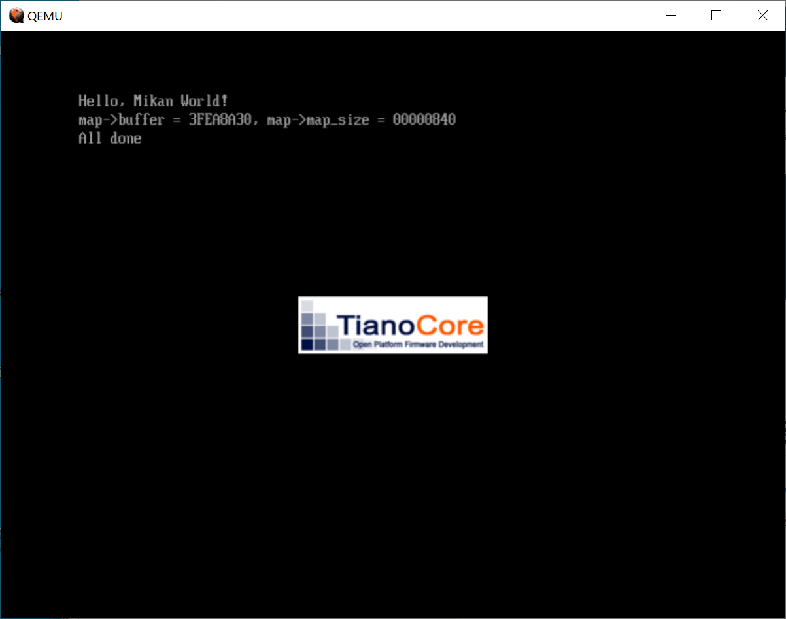
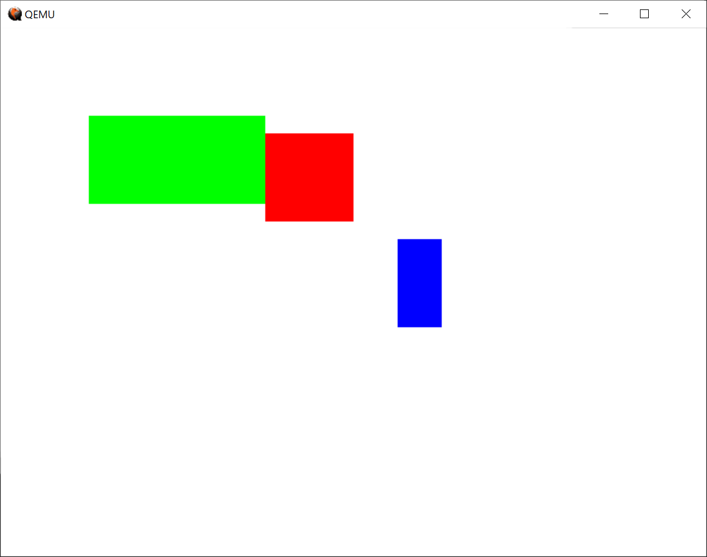
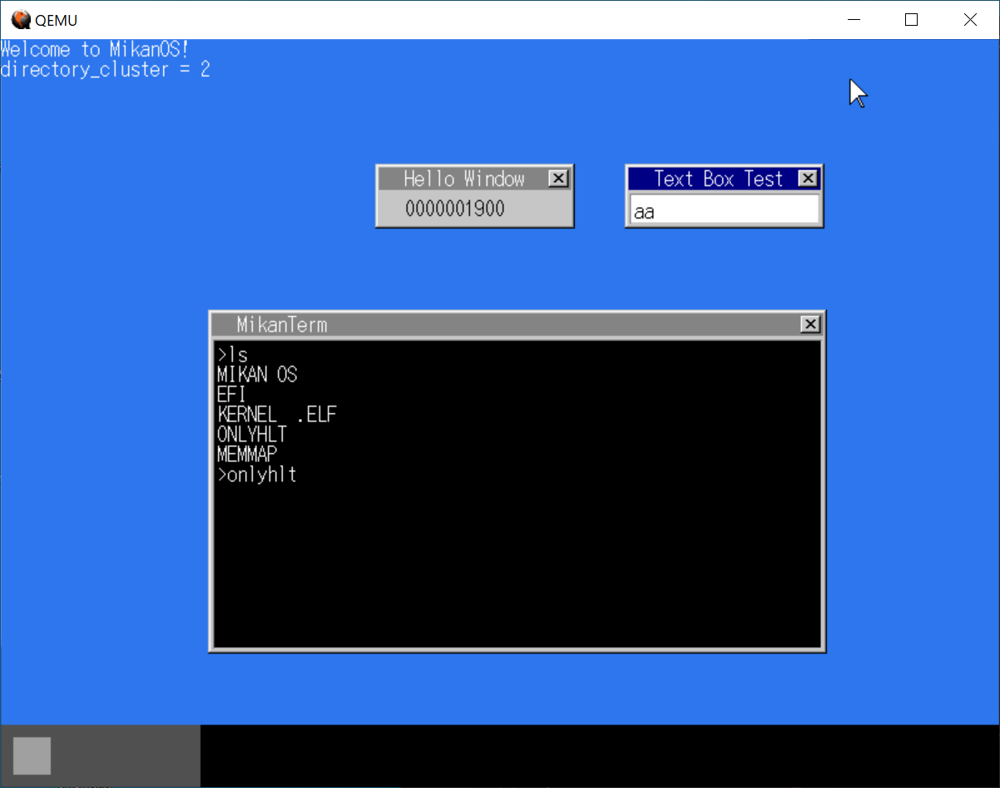
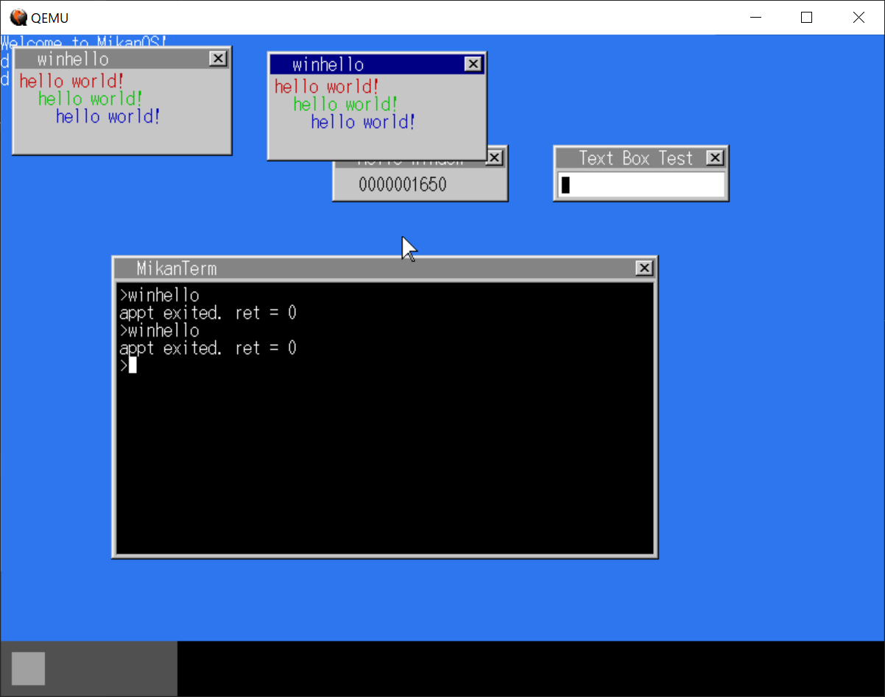
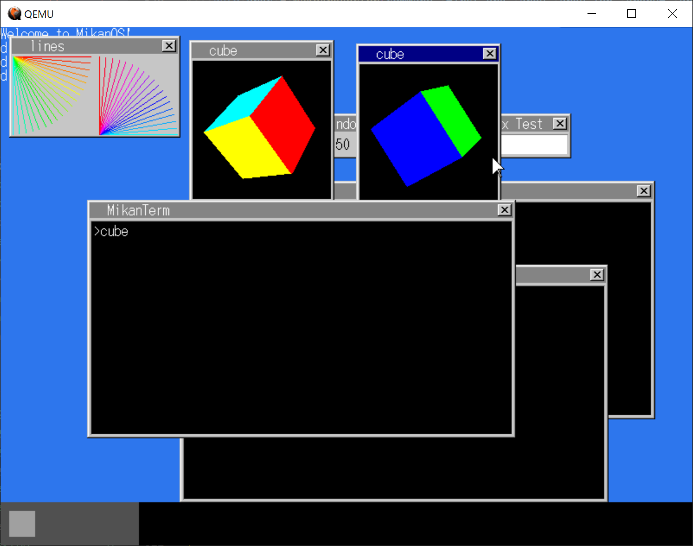
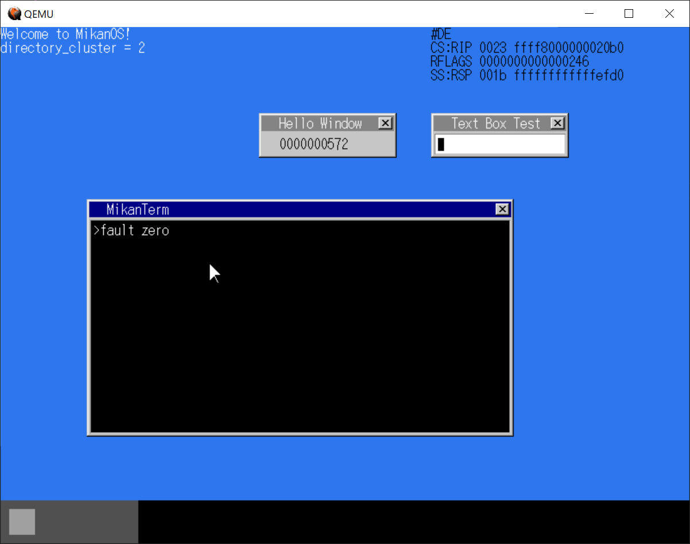

# ゼロからのOS自作入門

## 2021/05/01 （1日目）

WSLのUbuntu 18.04で作業。

開発環境は以下の通り。
- Windows10
- Ubuntu 18.04 on WSL2
- Visual Studio Code

```bash
$ sudo apt update && sudo apt upgrade
$ sudo apt install qemu
```

BZで謎の数列を書く。

```shell
$ hexdump -C BOOTX64.EFI
00000000  4d 5a 00 00 00 00 00 00  00 00 00 00 00 00 00 00  |MZ..............|
00000010  00 00 00 00 00 00 00 00  00 00 00 00 00 00 00 00  |................|
*
00000030  00 00 00 00 00 00 00 00  00 00 00 00 80 00 00 00  |................|
00000040  00 00 00 00 00 00 00 00  00 00 00 00 00 00 00 00  |................|
*
00000080  50 45 00 00 64 86 02 00  00 00 00 00 00 00 00 00  |PE..d...........|
00000090  00 00 00 00 f0 00 22 02  0b 02 00 00 00 02 00 00  |......".........|
000000a0  00 02 00 00 00 00 00 00  00 10 00 00 00 10 00 00  |................|
000000b0  00 00 00 40 01 00 00 00  00 10 00 00 00 02 00 00  |...@............|
000000c0  00 00 00 00 00 00 00 00  06 00 00 00 00 00 00 00  |................|
000000d0  00 30 00 00 00 02 00 00  00 00 00 00 0a 00 60 81  |.0............`.|
000000e0  00 00 10 00 00 00 00 00  00 10 00 00 00 00 00 00  |................|
*
00000100  00 00 00 00 10 00 00 00  00 00 00 00 00 00 00 00  |................|
00000110  00 00 00 00 00 00 00 00  00 00 00 00 00 00 00 00  |................|
*
00000180  00 00 00 00 00 00 00 00  2e 74 65 78 74 00 00 00  |.........text...|
00000190  14 00 00 00 00 10 00 00  00 02 00 00 00 02 00 00  |................|
000001a0  00 00 00 00 00 00 00 00  00 00 00 00 20 00 50 60  |............ .P`|
000001b0  2e 72 64 61 74 61 00 00  1c 00 00 00 00 20 00 00  |.rdata....... ..|
000001c0  00 02 00 00 00 04 00 00  00 00 00 00 00 00 00 00  |................|
000001d0  00 00 00 00 00 00 50 40  00 00 00 00 00 00 00 00  |......P@........|
000001e0  00 00 00 00 00 00 00 00  00 00 00 00 00 00 00 00  |................|
*
00000200  48 83 ec 28 48 8b 4a 40  48 8d 15 f1 0f 00 00 ff  |H..(H.J@H.......|
00000210  51 08 eb fe 00 00 00 00  00 00 00 00 00 00 00 00  |Q...............|
00000220  00 00 00 00 00 00 00 00  00 00 00 00 00 00 00 00  |................|
*
00000400  48 00 65 00 6c 00 6c 00  6f 00 2c 00 20 00 77 00  |H.e.l.l.o.,. .w.|
00000410  6f 00 72 00 6c 00 64 00  21 00 00 00 00 00 00 00  |o.r.l.d.!.......|
00000420  00 00 00 00 00 00 00 00  00 00 00 00 00 00 00 00  |................|
*
00000600
$ sum BOOTX64.EFI
12430     2
```

作った謎ファイルを使ってイメージファイルを作る。

```shell
$ qemu-img create -f raw disk.img 200M
Formatting 'disk.img', fmt=raw size=209715200
$ mkfs.fat -n 'MIKAN OS' -s 2 -f 2 -R 32 -F 32 disk.img
mkfs.fat 4.1 (2017-01-24)
$ mkdir -p mnt
$ sudo mount -o loop disk.img mnt
$ sudo mkdir -p mnt/EFI/BOOT
$ sudo cp BOOTX64.EFI mnt/EFI/BOOT/BOOTX64.EFI
```

WSLで必要なファイルを取ってくる。

```shell
$ git clone https://github.com/uchan-nos/mikanos-build.git osbook
```

VcXsrvを起動しておく。
ウィンドウを出すには、WSLのIPアドレスがXXX.YYY.ZZZ.AAAとすると、

```shell
$ export DISPLAY=XXX.YYY.ZZZ.AAA:0.0
```
と設定しておく。

```shell
$ qemu-system-x86_64 \
  -drive if=pflash,file=/mnt/e/work_dir/os/osbook/devenv/OVMF_CODE.fd \
  -drive if=pflash,file=/mnt/e/work_dir/os/osbook/devenv/OVMF_VARS.fd \
  -hda disk.img
```

なんかでた。


## 2021/05/02 （2日目）

p.43の`hello.c`を準備。

開発環境が入っていなかったのでインストール。

```sh
$ sudo apt install build-essential
$ sudo apt install clang lld
```

`Makefile`を準備していざコンパイルしようとしたけど、やっぱりエラーが出た。
`EFI_STATUS`の定義がないから変だと思ってた。開発環境に入ってた`hello.c`を見たら、いろいろ定義が入ってた。
確かに本文を読むと、`EfiMain`だけ取り出して説明していることになってた。

```cpp:hello.c
typedef unsigned short CHAR16;
typedef unsigned long long EFI_STATUS;
typedef void *EFI_HANDLE;

struct _EFI_SIMPLE_TEXT_OUTPUT_PROTOCOL;
typedef EFI_STATUS (*EFI_TEXT_STRING)(
  struct _EFI_SIMPLE_TEXT_OUTPUT_PROTOCOL  *This,
  CHAR16                                   *String);

typedef struct _EFI_SIMPLE_TEXT_OUTPUT_PROTOCOL {
  void             *dummy;
  EFI_TEXT_STRING  OutputString;
} EFI_SIMPLE_TEXT_OUTPUT_PROTOCOL;

typedef struct {
  char                             dummy[52];
  EFI_HANDLE                       ConsoleOutHandle;
  EFI_SIMPLE_TEXT_OUTPUT_PROTOCOL  *ConOut;
} EFI_SYSTEM_TABLE;

EFI_STATUS EfiMain(EFI_HANDLE        ImageHandle,
                   EFI_SYSTEM_TABLE  *SystemTable) {
  SystemTable->ConOut->OutputString(SystemTable->ConOut, L"Hello, world!\n");
  while (1);
  return 0;
}
```

昨日はNTFSで作ったディレクトリ`mnt`をマウントポイントに設定できてたのに、今日はできない。
昨日はWSL2の環境で動かしてたのに対し、いまWSL1の環境で作業してる。これが原因？

`osbook/devenv/run_emu.sh` を使って実行してもうまくいかなかった。

WSL2に変更した

```shell
> wsl --set-version Ubuntu-18.04 2
```

```sh
$ cd day01
$ make hello.efi
$ ./run_hello.sh
```


でた！

## 2021/05/03 （3日目）

開発環境をセットしきってなかった。
`https://github.com/uchan-nos/mikanos-build.git` の `devenv/ansible-provision.yml` にセットアップ方法がまとまってた。`ansible`を使う手順が書いてあったけど、中身を見て自分で打ち込んでみる。

```sh
$ sudo apt install build-essential llvm-7-dev lld-7 clang-7 nasm acpica-tools u
uid-dev qemu-system-x86 qemu-utils xauth unzip python3-distutils
$ cd osbook/devenv
$ git clone https://github.com/tianocore/edk2.git
$ cd edk2
$ git checkout -b 38c8be123aced4cc8ad5c7e0da9121a181b94251
$ cd ..
$ wget https://github.com/uchan-nos/mikanos-build/releases/download/v2.0/x86_64-elf.tar.gz
$ tar xf x86_64-elf.tar.gz
```

`clang-7`という感じでバージョン番号がついているファイルを、ついてないファイルにシンボリックしなおしていたので、`day02/rename_ln.sh`で対処した。

```sh
$ sudo day02/rename_ln.sh
```

これで開発環境ができた。

あとこれを、`.profile`に追加しておくと、Xウィンドウが出てくるようになる。
```
export DISPLAY=$(awk '/nameserver / {print $2; exit}' /etc/resolv.conf 2>/dev/null):0
```

2日目のデータ（`osbook_day02a`）を取り出すために、`Mikan OS`のリポジトリを取ってくる。

```sh
$ git clone https://github.com/uchan-nos/mikanos.git
```

```sh
$ cd mikanos
$ git checkout -b osbook_day02a
```

せっかくなので写経してみる。。。

`PACKAGE_GUID`は自分で作ったのを使ってみる。`uuidgen`というのが使えた。

```sh
$ uuidgen
dbe19b51-65ba-4b01-a8cd-b194af164088
```

写経したのでコンパイルしてみる。
さっきダウンロードした`edk2`の環境に、写経したファイルの入っているディレクトリのシンボリックリンクを作る。

```sh
$ cd osbllk/devenv/edk2
$ ln -s ../../../day02/MikanLoaderPkg .
```

開発環境にある`edksetup.sh`を読み込む。`conf`の下にファイルができる。
```sh
$ source edksetup.sh
$ ls Conf
BuildEnv.sh  ReadMe.txt  build_rule.txt  target.txt  tools_def.txt
```

`Conf/target.txt`を編集する。変更する箇所は下記の4か所。

- ACITVE_PLATFORM = MikanLoaderPkg/MikanLoaderPkg.sdc
- TARGET = DEBUG
- TARGET_ARCH = X64
- TOOL_CHAIN_TAG = CLANG38

ビルドする。

```sh
$ pwd
.../osbook/devenv/edk2
$ build
```

写経のTypoを直したりしたら、こんなエラーがでた。

```
BaseTools C Tool binary was not found (GenFw)
You may need to run:
  make -C xxxxx/BaseTools/Source/C
```

いう通りrunしてみたら、
```
BrotliCompress.c:20:10: fatal error: ./brotli/c/common/constants.h: No such file or directory
 #include "./brotli/c/common/constants.h"
          ^~~~~~~~~~~~~~~~~~~~~~~~~~~~~~~
compilation terminated.
../Makefiles/footer.makefile:21: recipe for target 'BrotliCompress.o' failed
make[1]: *** [BrotliCompress.o] Error 1
```

というエラーになった。
`ansible_provision.yml`を見直したら、いくつか手順を抜かしてた。

- `git clone`するとき`--recursive`を付けてなかった
  - `git submodule update --init --recursive` で対処
- ツールのコンパイル
  - `cd edk2/BaseTools/Source/C; make`

分からなくなるので環境の構築手順をまとめなおす。
すなおに`ansible`使えばよかった、、、

```sh
$ sudo apt install build-essential llvm-7-dev lld-7 clang-7 nasm acpica-tools u
uid-dev qemu-system-x86 qemu-utils xauth unzip python3-distutils
$ sudo day02/rename_ln.sh
$ cd osbook/devenv
$ git clone --recursive https://github.com/tianocore/edk2.git
$ cd edk2
$ git checkout -b 38c8be123aced4cc8ad5c7e0da9121a181b94251
$ cd BaseTools/Source/C
$ make
$ cd -
$ cd ..
$ wget https://github.com/uchan-nos/mikanos-build/releases/download/v2.0/x86_64-elf.tar.gz
$ tar xf x86_64-elf.tar.gz
```

`build`しなおしたらBUILDに成功した。

```sh
$ ../run_qemu.sh Build/MikanLoaderX64/DEBUG_CLANG38/X64/Loader.efi
```


でた。

## 2021/05/04 （４日目）

`osbook_day02b`の`Main.c`を写経する。

`build`してQEMUを起動した。


```sh
$ sudo mount -o loop disk.img mnt
$ cat mnt/memmap
Index, Type, Type(name), PhysicalStart, NumberOfPages, Attribute
@dw>@dw>@dw>@dw>@dw>@dw>@dw>@dw>@dw>@dw>@dw>@dw>@dw>@dw>@dw>@dw>@dw>@dw>@dw>@dw>@dw>@dw>@dw>@dw>@dw>@dw>@dw>@dw>@dw>@dw>@dw>@dw>@dw>@dw>@dw>@dw>@dw>@dw>@dw>@dw>@dw>@dw>@dw>@dw>
```

なんか出たけど、化けてる。。。

`Main.c`を見直したら、間違いが見つかった。
`len = AsciiSPrint(` が `len = AsciiPrint(` になっていた（`S`が抜けていた）。

[同じ間違いをしている人がいた](https://twitter.com/rsamodpq/status/1381268987124666371)。SがあるほうはNull終端するPrintらしいと、この人は分析している。

で、でた。



```sh
$ sudo mount -o loop disk.img mnt
$ cat mnt/memmap
Index, Type, Type(name), PhysicalStart, NumberOfPages, Attribute
0, 3, EfiBootServicesCode, 00000000, 1, F
1, 7, EfiConventionalMemory, 00001000, 9F, F
2, 7, EfiConventionalMemory, 00100000, 700, F
3, A, EfiACPIMemoryNVS, 00800000, 8, F
4, 7, EfiConventionalMemory, 00808000, 8, F
5, A, EfiACPIMemoryNVS, 00810000, F0, F
6, 4, EfiBootServicesData, 00900000, B00, F
7, 7, EfiConventionalMemory, 01400000, 3AB36, F
8, 4, EfiBootServicesData, 3BF36000, 20, F
9, 7, EfiConventionalMemory, 3BF56000, 270F, F
10, 1, EfiLoaderCode, 3E665000, 2, F
11, 4, EfiBootServicesData, 3E667000, 217, F
12, 3, EfiBootServicesCode, 3E87E000, B6, F
13, A, EfiACPIMemoryNVS, 3E934000, 12, F
14, 0, EfiReservedMemoryType, 3E946000, 1C, F
15, 3, EfiBootServicesCode, 3E962000, 10A, F
16, 6, EfiRuntimeServicesData, 3EA6C000, 5, F
17, 5, EfiRuntimeServicesCode, 3EA71000, 5, F
18, 6, EfiRuntimeServicesData, 3EA76000, 5, F
19, 5, EfiRuntimeServicesCode, 3EA7B000, 5, F
20, 6, EfiRuntimeServicesData, 3EA80000, 5, F
21, 5, EfiRuntimeServicesCode, 3EA85000, 7, F
22, 6, EfiRuntimeServicesData, 3EA8C000, 8F, F
23, 4, EfiBootServicesData, 3EB1B000, 4DA, F
24, 7, EfiConventionalMemory, 3EFF5000, 4, F
25, 4, EfiBootServicesData, 3EFF9000, 6, F
26, 7, EfiConventionalMemory, 3EFFF000, 1, F
27, 4, EfiBootServicesData, 3F000000, A1B, F
28, 7, EfiConventionalMemory, 3FA1B000, 1, F
29, 3, EfiBootServicesCode, 3FA1C000, 17F, F
30, 5, EfiRuntimeServicesCode, 3FB9B000, 30, F
31, 6, EfiRuntimeServicesData, 3FBCB000, 24, F
32, 0, EfiReservedMemoryType, 3FBEF000, 4, F
33, 9, EfiACPIReclaimMemory, 3FBF3000, 8, F
34, A, EfiACPIMemoryNVS, 3FBFB000, 4, F
35, 4, EfiBootServicesData, 3FBFF000, 201, F
36, 7, EfiConventionalMemory, 3FE00000, 8D, F
37, 4, EfiBootServicesData, 3FE8D000, 20, F
38, 3, EfiBootServicesCode, 3FEAD000, 20, F
39, 4, EfiBootServicesData, 3FECD000, 9, F
40, 3, EfiBootServicesCode, 3FED6000, 1E, F
41, 6, EfiRuntimeServicesData, 3FEF4000, 84, F
42, A, EfiACPIMemoryNVS, 3FF78000, 88, F
43, 6, EfiRuntimeServicesData, FFC00000, 400, 1
```

## 2021/05/05 （5日目）

3章。


なんかでた。

QEMU起動直後と、while(1)で止まっているときと、でレジスタの値が変わってる。デバッグしてる感じ。

```
(qemu) info registers
RAX=0000000000000000 RBX=0000000000000001 RCX=000000003fb7b1c0 RDX=0000000000000002
RSI=0000000000000400 RDI=000000003fea9270 RBP=000000000000002c RSP=000000003fea88a0
R8 =00000000000000af R9 =0000000000000288 R10=0000000000000050 R11=0000000000000000
R12=000000003e666568 R13=000000003fea8930 R14=000000003e7747a0 R15=000000003fea88e8
RIP=000000003e665416 RFL=00000202 [-------] CPL=0 II=0 A20=1 SMM=0 HLT=0
ES =0030 0000000000000000 ffffffff 00cf9300 DPL=0 DS   [-WA]
CS =0038 0000000000000000 ffffffff 00af9a00 DPL=0 CS64 [-R-]
SS =0030 0000000000000000 ffffffff 00cf9300 DPL=0 DS   [-WA]
DS =0030 0000000000000000 ffffffff 00cf9300 DPL=0 DS   [-WA]
FS =0030 0000000000000000 ffffffff 00cf9300 DPL=0 DS   [-WA]
GS =0030 0000000000000000 ffffffff 00cf9300 DPL=0 DS   [-WA]
LDT=0000 0000000000000000 0000ffff 00008200 DPL=0 LDT
TR =0000 0000000000000000 0000ffff 00008b00 DPL=0 TSS64-busy
GDT=     000000003fbee698 00000047
IDT=     000000003f306018 00000fff
CR0=80010033 CR2=0000000000000000 CR3=000000003fc01000 CR4=00000668
DR0=0000000000000000 DR1=0000000000000000 DR2=0000000000000000 DR3=0000000000000000
DR6=00000000ffff0ff0 DR7=0000000000000400
EFER=0000000000000500
FCW=037f FSW=0000 [ST=0] FTW=00 MXCSR=00001f80
FPR0=0000000000000000 0000 FPR1=0000000000000000 0000
FPR2=0000000000000000 0000 FPR3=0000000000000000 0000
FPR4=0000000000000000 0000 FPR5=0000000000000000 0000
FPR6=0000000000000000 0000 FPR7=0000000000000000 0000
XMM00=00000000000000000000000000000000 XMM01=00000000000000000000000000000000
XMM02=00000000000000000000000000000000 XMM03=00000000000000000000000000000000
XMM04=00000000000000000000000000000000 XMM05=00000000000000000000000000000000
XMM06=00000000000000000000000000000000 XMM07=00000000000000000000000000000000
XMM08=00000000000000000000000000000000 XMM09=00000000000000000000000000000000
XMM10=00000000000000000000000000000000 XMM11=00000000000000000000000000000000
XMM12=00000000000000000000000000000000 XMM13=00000000000000000000000000000000
XMM14=00000000000000000000000000000000 XMM15=00000000000000000000000000000000
```

本の手順にしたがって、`RIP`のアドレスのところを見てみる。

```
(qemu) x /4xb 0x000000003e665416
000000003e665416: 0xeb 0xfe 0x55 0x41
(qemu) x /4ib 0x000000003e665416
0x000000003e665416:  jmp    0x3e665416
0x000000003e665418:  push   %rbp
0x000000003e665419:  push   %r15
0x000000003e66541b:  push   %r14
```

`jmp`で同じアドレスに飛んでる。`while (1);`のところっぽい。

次は、カーネルを作る作業に移る。

`day03/kernel/main.cpp`に3.3節のソースコードを写経する。

`day03/kernel/Makefile`を作ってコンパイル手順を残しておく。

## 2021/05/06 （6日目）

30日では終わらなそう。

昨日作った`kernel.elf`を`readelf`で覗いてみる。

```sh
$ readelf kernel.elf
ELF Header:
  Magic:   7f 45 4c 46 02 01 01 00 00 00 00 00 00 00 00 00 
  Class:                             ELF64
  Data:                              2's complement, little endian
  Version:                           1 (current)
  OS/ABI:                            UNIX - System V
  ABI Version:                       0
  Type:                              EXEC (Executable file)
  Machine:                           Advanced Micro Devices X86-64
  Version:                           0x1
  Entry point address:               0x101000
  Start of program headers:          64 (bytes into file)
  Start of section headers:          8928 (bytes into file)
  Flags:                             0x0
  Size of this header:               64 (bytes)
  Size of program headers:           56 (bytes)
  Number of program headers:         4
  Size of section headers:           64 (bytes)
  Number of section headers:         14
  Section header string table index: 12
```

```sh
$ cd MikanOS/day03a
$ ./bat.sh
$ ../../osbook/devenv/run_qemu.sh ../../edk2/Build/MikanLoaderX64/DEBUG_CLANG38/X64/Loader.efi kernel/kernel.elf
```


とりあえず`kernel.elf`を読み込んで実行できてそう。

```
(qemu) info registers
RAX=0000000000100000 RBX=000000003effef18 RCX=0000000000000000 RDX=0000000000000000
RSI=000000003feaca08 RDI=000000003feac9e0 RBP=000000003fea8850 RSP=000000003fea8850
R8 =000000003fea87c4 R9 =000000003fb7b48f R10=000000003fbcd018 R11=fffffffffffffffc
R12=000000003effe920 R13=000000003feac8d0 R14=000000003fea9110 R15=000000003e66573c
RIP=0000000000101011 RFL=00000046 [---Z-P-] CPL=0 II=0 A20=1 SMM=0 HLT=1
ES =0030 0000000000000000 ffffffff 00cf9300 DPL=0 DS   [-WA]
CS =0038 0000000000000000 ffffffff 00af9a00 DPL=0 CS64 [-R-]
SS =0030 0000000000000000 ffffffff 00cf9300 DPL=0 DS   [-WA]
DS =0030 0000000000000000 ffffffff 00cf9300 DPL=0 DS   [-WA]
FS =0030 0000000000000000 ffffffff 00cf9300 DPL=0 DS   [-WA]
GS =0030 0000000000000000 ffffffff 00cf9300 DPL=0 DS   [-WA]
LDT=0000 0000000000000000 0000ffff 00008200 DPL=0 LDT
TR =0000 0000000000000000 0000ffff 00008b00 DPL=0 TSS64-busy
GDT=     000000003fbee698 00000047
IDT=     000000003f306018 00000fff
CR0=80010033 CR2=0000000000000000 CR3=000000003fc01000 CR4=00000668
DR0=0000000000000000 DR1=0000000000000000 DR2=0000000000000000 DR3=0000000000000000 
DR6=00000000ffff0ff0 DR7=0000000000000400
EFER=0000000000000500
FCW=037f FSW=0000 [ST=0] FTW=00 MXCSR=00001f80
FPR0=0000000000000000 0000 FPR1=0000000000000000 0000
FPR2=0000000000000000 0000 FPR3=0000000000000000 0000
FPR4=0000000000000000 0000 FPR5=0000000000000000 0000
FPR6=0000000000000000 0000 FPR7=0000000000000000 0000
XMM00=00000000000000000000000000000000 XMM01=00000000000000000000000000000000
XMM02=00000000000000000000000000000000 XMM03=00000000000000000000000000000000
XMM04=00000000000000000000000000000000 XMM05=00000000000000000000000000000000
XMM06=00000000000000000000000000000000 XMM07=00000000000000000000000000000000
XMM08=00000000000000000000000000000000 XMM09=00000000000000000000000000000000
XMM10=00000000000000000000000000000000 XMM11=00000000000000000000000000000000
XMM12=00000000000000000000000000000000 XMM13=00000000000000000000000000000000
XMM14=00000000000000000000000000000000 XMM15=00000000000000000000000000000000
```

`RIP=0000000000101011` なので、このアドレスの命令を見てみる。

```
(qemu) x /2i 0x101011
0x0000000000101011:  jmp    0x101010
0x0000000000101013:  int3   
(qemu) x /2i 0x101010
0x0000000000101010:  hlt    
0x0000000000101011:  jmp    0x101010
```

で`hlt`になってた。
`hlt`の次の行の`jmp 0x101010`は、`main.cpp`の`while (1)`のことのようだ。

```cpp:main.cpp
extern "C" void KernelMain() {
    while (1) __asm__("hlt");
}
```

## 2021/05/07 （7日目）

今日は3.4節から。

`Main.c`に`OpenGOP`、`GetPixelFormatUnicode`の関数を追加、`UefiMain`に`gop`を使う命令を追加した。

```sh
$ cd day03b
$ cd kernel; make; cd ..
$ ./bat.sh
$ ../../osbook/devenv/run_qemu.sh ../../edk2/Build/MikanLoaderX64/DEBUG_CLANG38/X64/Loader.efi kernel/kernel.elf
```

でた！


白く塗りつぶしてしまって、画面の解像度情報とかが見えなくなってるので、塗りつぶさないようにしてみた。


- 解像度は800x600 （1行に800画素）
- BGR
- フレームバッファは0x80000000～0x801D5000で、サイズは1,921,024バイト
  - 800x600x4バイト=1,920,000バイト
  - 1ページ4096バイト単位だから切り上げて、1,921,024 (=int((1,920,000+0xFFF)/0x1000)*0x1000)

## 2021/05/08 （8日目）

今日は`osbook_day03c`のところ。

`kernel/main.cpp`を改造する。

```sh
$ cd day03c
$ source ../../osbook/devenv/buildenv.sh
```

`source`している`buildenv.sh`の中身を一応見ておくと、`CPPFLAGS`と`LDFLAGS`が環境変数として宣言されていた。

```sh
$ cat ../../osbook/devenv/buildenv.sh 
# Usage: source buildenv.sh

BASEDIR="$HOME/osbook/devenv/x86_64-elf"
EDK2DIR="$HOME/edk2"
export CPPFLAGS="\
-I$BASEDIR/include/c++/v1 -I$BASEDIR/include -I$BASEDIR/include/freetype2 \
-I$EDK2DIR/MdePkg/Include -I$EDK2DIR/MdePkg/Include/X64 \
-nostdlibinc -D__ELF__ -D_LDBL_EQ_DBL -D_GNU_SOURCE -D_POSIX_TIMERS \
-DEFIAPI='__attribute__((ms_abi))'"
export LDFLAGS="-L$BASEDIR/lib"
```

この環境変数を使うように`Makefile`を書き換えておく。

```Makefile
all: main.cpp
	clang++ $(CPPFLAGS) -O2 -Wall -g --target=x86_64-elf -ffreestanding -mno-red-zone -fno-exceptions -fno-rtti -std=c++17 -c main.cpp
	ld.lld $(LDFLAGS) --entry KernelMain -z norelro --image-base 0x100000 --static -o kernel.elf main.o
```

```sh
$ cd day03c
$ ./bat.sh
$ ../../osbook/devenv/run_qemu.sh ../../edk2/Build/MikanLoaderX64/DEBUG_CLANG38/X64/Loader.efi kernel/kernel.elf
```

でた。


## 2021/05/09 （9日目）

今日は3.6節から。エラー処理の追加。

```sh
$ cd day03d
$ source ../../osbook/devenv/buildenv.sh
$ (cd kernel; make)
$ ./bat.sh
$ ../../osbook/devenv/run_qemu.sh ../../edk2/Build/MikanLoaderX64/DEBUG_CLANG38/X64/Loader.efi kernel/kernel.elf
```

エラー処理の追加だけだから、変化なし。

故意にエラーを出してみたいけど、ちょっと今回は飛ばす。そのうち出るでしょう。

## 2021/05/10 （10日目）

今日は4.1節から。

`.PHONY`を書いたことなかった。。。

すでに`kernel`に`Makefile`を書いてたけど、書き直した。→ `day04a`


`day04b` を編集して、

```sh
$ cd day04b
$ source ../../osbook/devenv/buildenv.sh
$ (cd kernel; make)
$ ./bat.sh
$ ../../osbook/devenv/run_qemu.sh ../../edk2/Build/MikanLoaderX64/DEBUG_CLANG38/X64/Loader.efi kernel/kernel.elf
```


緑の四角が描けた。

他の色で四角が描けるか試すために`kernel/main.cpp`に下記を追加した。

```cpp
    for (int x = 0; x < 100; ++x)
    {
        for (int y = 0; y < 100; ++y)
        {
            WritePixel(frame_buffer_config, 300 + x, 120 + y, {255, 0, 0});
        }
    }

    for (int x = 0; x < 50; ++x)
    {
        for (int y = 0; y < 100; ++y)
        {
            WritePixel(frame_buffer_config, 450 + x, 240 + y, {0, 0, 255});
        }
    }
```



うまく描けた。

## 2021/05/11 （11日目）

今日は4.3節から。

配置newのことを初めて知った。
普段何気なく使っているヒープ領域はOSがあって初めて利用できる領域ということも知らなかった。
確かにメモリ領域の確保や解放は、空き領域を探したり再利用できるようにする仕組みがないと使えない。なるほど。

今日は`kernel/main.cpp`を編集した。

```sh
$ cd day04c
$ source ../../osbook/devenv/buildenv.sh
$ (cd kernel; make)
$ ./bat.sh
$ ../../osbook/devenv/run_qemu.sh ../../edk2/Build/MikanLoaderX64/DEBUG_CLANG38/X64/Loader.efi kernel/kernel.elf
```


## 2021/05/12 （12日目）

今日は4.5節から。

```sh
$ readelf -l kernel.elf

Elf file type is EXEC (Executable file)
Entry point 0x101020
There are 5 program headers, starting at offset 64

Program Headers:
  Type           Offset             VirtAddr           PhysAddr
                 FileSiz            MemSiz              Flags  Align
  PHDR           0x0000000000000040 0x0000000000100040 0x0000000000100040
                 0x0000000000000118 0x0000000000000118  R      0x8
  LOAD           0x0000000000000000 0x0000000000100000 0x0000000000100000
                 0x00000000000001a8 0x00000000000001a8  R      0x1000
  LOAD           0x0000000000001000 0x0000000000101000 0x0000000000101000
                 0x0000000000000259 0x0000000000000259  R E    0x1000
  LOAD           0x0000000000002000 0x0000000000102000 0x0000000000102000
                 0x0000000000000000 0x0000000000000018  RW     0x1000
  GNU_STACK      0x0000000000000000 0x0000000000000000 0x0000000000000000
                 0x0000000000000000 0x0000000000000000  RW     0x0

 Section to Segment mapping:
  Segment Sections...
   00     
   01     .rodata 
   02     .text 
   03     .bss 
   04     
```

`Main.c`で新しく追加した関数は、ヘッダファイルの中のアドレスを見て、使いたい領域のアドレスまでジャンプする処理になっている。
データ構造の設計がうまくいっているからこのように実装できるんだろうけど、ちょっと考えないとついていけなくなる。

```sh
$ cd day04d
$ source ../../osbook/devenv/buildenv.sh
$ (cd kernel; make)
$ ./bat.sh
$ ../../osbook/devenv/run_qemu.sh ../../edk2/Build/MikanLoaderX64/DEBUG_CLANG38/X64/Loader.efi kernel/kernel.elf
```


画面に代り映えがないけど、出た。

## 2021/05/13 （13日目）

今日は5.1節から。

`A`を1度っとずつ描くのは楽しい。

本と違って3つ出るようにした。

```cpp
    WriteAscii(*pixel_writer, 50, 50, 'A', {0, 0, 0});
    WriteAscii(*pixel_writer, 58, 50, 'A', {0, 0, 0});
    WriteAscii(*pixel_writer, 58, 66, 'A', {0, 0, 0});
```

```sh
$ cd day05a
$ source ../../osbook/devenv/buildenv.sh
$ (cd kernel; make)
$ ./bat.sh
$ ../../osbook/devenv/run_qemu.sh ../../edk2/Build/MikanLoaderX64/DEBUG_CLANG38/X64/Loader.efi kernel/kernel.elf
```


`A`がでた！


## 2021/05/14 （14日目）

今日は5.2節から。

分割コンパイルできるように`main.cpp`の一部を`font.cpp/hpp`と`graphics.cpp/hpp`に分割した。
`.gitignore`も追加した。`mikanos`のリポジトリでは`kernel`の中に置いていたけど、`./bat.sh`で作られる`disk.img`も除外できるように、一つ上のディレクトリに置いて除外候補に追加した。

```sh
$ cd day05b
$ source ../../osbook/devenv/buildenv.sh
$ (cd kernel; make)
$ ./bat.sh
$ ../../osbook/devenv/run_qemu.sh ../../edk2/Build/MikanLoaderX64/DEBUG_CLANG38/X64/Loader.efi kernel/kernel.elf
```

ソースコードを分割しただけなので、昨日と同じ結果だけど、出た。


次は5.3節。

フォントデータは下記のところから取ってきたもののようだ。

http://openlab.ring.gr.jp/efont/dist/shinonome/shinonome-0.9.11-src.tar.bz2

`hankaku/font_src.bit` が元データのようだけど、並び替えとか前処理が必要そう。
今回はmikanosのリポジトリにおいてある処理済みの`kernel/henkaku.txt`を使う。

```Makefile
hankaku.bin: hankaku.txt
	../tools/makefont.py -o $@ $<

hankaku.o: hankaku.bin
	objcopy -I binary -O elf64-x86-64 -B i386:x86-64 $< $@
```

この操作でできた`henkaku.o`を`objdump`で見てみた。

```sh
$ objdump -t hankaku.o

hankaku.o:     file format elf64-x86-64

SYMBOL TABLE:
0000000000000000 l    d  .data  0000000000000000 .data
0000000000000000 g       .data  0000000000000000 _binary_hankaku_bin_start
0000000000001000 g       .data  0000000000000000 _binary_hankaku_bin_end
0000000000001000 g       *ABS*  0000000000000000 _binary_hankaku_bin_size
```

`objcopy`で上のようなシンボルテーブルが作られたようだ。

Pythonスクリプト`tools/makefont.py`は、`henkaku.txt`内の`.`と`@`がある行を見つけ、それをそのまま1バイトの数字に置き換える処理をしていた。
256文字で1文字あたり16バイトなので、フォントデータは全部で256*16=4096=0x1000バイト。

`kernel/font.cpp`の`GetFont()`では、文字コードに16を掛けて`index`を求め、`_binary_hankaku_bin_start`からのオフセットとして計算し、フォントデータのアドレスを求める。

なるほど。

シンボルテーブルを作ってリンクしてしまえば、バイナリデータを直接使えるようになるってことか。
バイナリファイルを`xxd -i`でヘッダファイルに変換して使ったことがあったけど。このやり方でもたぶん行ける。
後者のやり方だと、ファイルが大きくなってしまうけど。


出た。


## 2021/05/15 （15日目）

今日は5.4節から。文字列の描画。

実装は簡単だった。けど、`newlib_support.c`が謎。もう少し増えてきたらちょっと調査してみたい。


とりあえず出た。

続いて、5.5節。


テキストが流れるような動きが出ると、なんかインタラクティブなシステムを作ってるんだなと実感がわく。

27行とケチケチせずに、0x1000行出すようにしてみた。

```cpp
    char buf[128];
    for (int i=0; i<0x1000; ++i){
        sprintf(buf, "line %d\n", i);
        console.PutString(buf);
    }
```

ちらつきながらかなり時間を要して4095番目まで表示した。


さらに続けて5.6節。


出せた。

## 2021/05/16 （16日目）

今日から６章。OSに入力手段を実装する章。

6.1節はOSっぽい画面の表示。

動かせないけどカーソルが出てくるとGUIっぽさが出てくる。


## 2021/05/17 （17日目）

昨日6.2節を読んだ後、USBドライバのソースコードを覗いてみた。
USBの仕様書を片手に読まないとわからない感じだった。
一通り読み終わって余力があったら解析してみたいなあ。

今日は6.3節から。
接続されているPCIデバイスを列挙する。

今日は今までより写経の分量が多かった。


PCIデバイスを画面に列挙できた。これらが何かは明日以降調べよう。。。

## 2021/05/18 （18日目）

今日は6.4節。マウスカーソルが動くようになる。

今回の写経の量が多すぎて疲れた。


とりあえず動いた。

過去に実装した関数にも手が入っていて、修正漏れがたくさん出てしまった。
特に`pci.cpp`と`pci.hpp`で、戻り値の`Error`の定義を変えてしまってて、ほぼすべての関数に手が入ってた。

入力装置が使えるようになったのは進歩を実感した。
ただ肝になる部分であるUSBドライバがよくわかってないので、ちょっと気持ち悪い気もする。

## 2021/05/19 （19日目）

昨日の6.4節のところを無心に写経したもんで、ほとんど記憶に残ってない。
ちょっと復習してみる。

6.3節のPCIのところから分かってなかった。

PCに接続されているPCIを列挙することを考える。
そのためにはPCIコンフィグレーション空間（142ページ図6.3）を読んでくればいい。

ここを読むためには、IOアドレス空間の0x0CF8のCONFIG_ADDRESSレジスタと、
0x0CFCにあるCONFIG_DATAレジスタを使う。

CONFIG_ADDRESSレジスタは、[31:0]の変数になっていて、
- [31] Enableビット。1にするとCONFIG_DATAでPCIコンフィグレーション空間を読み書きできる
- [30:24] 予約領域。0に設定する
- [23:16] バス番号（0-255）
- [15:11] デバイス番号（0-31）
- [10:8] ファンクション番号（0-7）
- [7:0] レジスタオフセット（0-255）。4バイト単位のオフセットを指定する

CONFIG_ADDRESSを作る為の関数が`MakeAddress()`。
Enableビットが1になるようになっているため、この関数で作った値でCONFIG_ADDRESSレジスタにアクセスすると、CONFIG_DATAからデータを読むことができる。

- `Vendor ID`を読むのが`ReadVendorId()`
- `Device ID`を読むのが`ReadDeviceId()`
- `Header Type`を読むのが`ReadHeaderType()`
- `Base Class`, `Sub Class`, `Interface`の3つをまとめて読むのが`ReadClassCode()`

など。
中でやっているのは、CONFIG_ADDRESSに値を設定して、CONFIG_DATAで読みだした値をビット演算で切り出しているだけ。

よくわからないのが、`ScanAllBus()`でやっていること。
おそらくPCIバスがどういう接続を想定してるのかが分からないからだと思う。

いい記事が見つからなかったけど、[このOracleの記事](https://docs.oracle.com/cd/E38900_01/html/E38872/hwovr-25520.html)の図A-3でなんとなく分かった。

始めは、CPUに存在するすべてのバスが直接つながっているのかと思っていた。だからよくわからなかった。

本当は、CPUに直接つながっているのはPCIホストブリッジで、バス0にはそのブリッジを介して接続する。バス0以外のバスはPCIバスブリッジを介して接続する、という階層構造になっていた。

149ページのリスト6.15で、ベースクラス0x06・サブクラス0x04であるPCIブリッジを探索し、`Base Address Register 2`を読み出していた。
なんでそんなことしているのか？と思ってたけど、そこは下位の階層のバス番号が書いてあって、それを使ってそのバスにつながっている機器を探索する。という作りになっていた。

これで6.3節でやっていることが分かった。

明日は6.4節を復習しよう。

## 2021/05/20 （20日目）

今日は6.4節の復習。

6.3節が分かれば、xHCを探すところはすぐわかる。
`ScanAllBus()`で探索した`devices`を一つずつ取り出して、クラスコードが0x0c,0x03,0x30のものを見つける。
そういえば、見つからなかった時のエラー処理は入れてないみたい。

Base Address Registerは`CalcBarAddress()`で計算する。
PCIコンフィグレーション空間の0x10から始まっているから、`bar_index`をオフセットにして求めるのは分かるけど、
`ReadConfReg()`で取り出した`bar`の2ビット目（`(bar & 4u)`してるとこ）が、0だったら32bitだと思ってそのまま終わって、
そうでないときは64bitだと思ってさらに32bit読んで連結している。

どういう仕様？特に書いてないなあ。

`SwitchEhci2Xhci()`を実装した経緯をまとめているあたり、デバイスドライバを書く人の苦労を感じる。
これまでハードウェア設計して来で、レジスタ仕様を決めると、ソフト書く人大変そうだなあ、と思うことがたまにあった。
Linuxに先達が調べて実装した成果が残ってたからいいけど（それを見つけるだけでも大変だけど）、適当な仕様書からソフトを起こすのは大変そうだなあ。

`usb::HIDMouseDriver::default_observer`にマウスが動作したときのコールバック関数を登録している。

この作りだとマウスが2個以上接続されていても、それぞれの動きを検出して動くようになってそう。
ちょうどいま2個マウスが接続されているけど、いまはQEMUで動作確認しているから、ホストOSが2個のマウスに対応しているのか、ゲストOSが対応しているのか見分けがつかないなあ。


明日から7章に取り掛かる。

## 2021/05/21 （21日目）

今日から7章。

x86-64での割り込みはちょっと書くことが多くて複雑そう。
たまに使ってるArduinoだと、下記のように[`attachInterrupt()`で関数を登録する](https://www.arduino.cc/reference/en/language/functions/external-interrupts/attachinterrupt/)だけだった。

```cpp
const byte ledPin = 13;
const byte interruptPin = 2;
volatile byte state = LOW;

void setup() {
  pinMode(ledPin, OUTPUT);
  pinMode(interruptPin, INPUT_PULLUP);
  attachInterrupt(digitalPinToInterrupt(interruptPin), blink, CHANGE);
}

void loop() {
  digitalWrite(ledPin, state);
}

void blink() {
  state = !state;
}
```

使っているマイコンで割り込みを設定するのにはもう少し手続きが必要っぽいけど、Arduinoのライブラリを使っていれば結構簡単に使える。
ハードウェアの制約に気を付ける必要はあるけど。

## 2021/05/22 （22日目）

昨日は途中で止めてしまったので、今日はきりの良い7.6節まで読んで写経を開始する。

あまり理解せずに無心で写経してしまった。


一応ちゃんと動いた。

MSIに関して本文であまり解説がなかったけど、コード量はかなりあった。
基本的な仕様は書いてあるので、読み解けそう。


## 2021/05/23 （23日目）

7.5節を復習。

PCIデバイスのIRQ設定で苦労してたことがよみがえってきた。

ディップスイッチでどの割り込みにするかを決める必要があった。
初めてSCSIのHDDを買って、拡張ボードを組み込むとき何をどう決めればいいのか分からず戸惑った記憶がある。

確かにある時期からこの設定をしなくてよくなった。あまりその辺の事情を知らずに使っていたんだなあ。

2000年ごろに買って本棚に入れっぱなしにしてたPCIデバイス設計関連の書籍があって、
ちょっと眺めてみたら確かにINT A#～D#の4本の割り込み信号を共有することが書いてあった。

さて。

`CapabilityHeader()`とか`MSICapability()`とかが分からな過ぎてつらい。

`ReadCapabilityHeader()`の使い方を追ってみると、PCIコンフィグレーション空間の(p.142 図6.3)0x34の下位8bitを見ていた。

```cpp
    Error ConfigureMSI(const Device &dev,
                       uint32_t msg_addr,
                       uint32_t msg_data,
                       unsigned int num_vector_exponent)
    {
        uint8_t cap_addr = ReadConfReg(dev, 0x34) & 0xffu;
        uint8_t msi_cap_addr = 0;
        uint8_t msix_cap_addr = 0;
        while (cap_addr != 0)
        {
            auto header = ReadCapabilityHeader(dev, cap_addr)
```


`Capabilities Pointer`なるものが格納されていた。
ここに格納されている8bitのアドレスを使って、さらにPCIコンフィグレーション空間を探索していた。

処理途中をダンプしてみた。


`next_ptr`を順にたどって、
0x90にCapabilityMSIXが、
0x70にCapabilityMSIがみつかった。

その見つかったアドレスを使って、`ConfigureMSIRegister()`で、
p.169で説明されたMessage AddressレジスタとMessage Dataレジスタを設定する、と。


## 2021/05/24 （24日目）

今日は7.7節から。

リングバッファを用意してそれをQueueとして使い、割り込み情報を一時保管する場として使うようにする改造。

無心に写経した。


出た。

Queueに保存するのは、何で割り込みが入ったか、という情報だけで、
肝心の送られてきたデータ自体は後で`ProcessEvent(xhc)`で処理するようになっている。

中身を追ってみたけどちょっとよくわからなかったが、
少なくとも`__asm__("cli")`と`__asm__("sti")`との間の割り込み禁止期間の外側なので、
マウスカーソルの描画処理の最中に追加で割り込みが来ても、無視されることはない。


## 2021/05/25 （25日目）

今日から8章。メモリ管理を実装する章。


とりあえずでた。

4日目に出したメモリマップの一部を抜き出したものになっていた。

```cpp
    const std::array available_memory_types{
        MemoryType::kEfiBootServicesCode,
        MemoryType::kEfiBootServicesData,
        MemoryType::kEfiConventionalMemory,
    };
```
で定義したタイプだけ出すようにしてあった。Kernelで空き容量として使えるメモリ領域のようだ。
次の節で説明するっぽい。

## 2021/05/26 （26日目）

今日は8.3節から。

わざわざ`kEfiBootServicesData`のデータを移し替えなくてもいいような気がしたけど、
メモリマップを見直すとかなりの領域を`kEfiBootServicesData`が占めていて、この領域を使わないのは確かにもったいない気がした。

8.4節のスタックの移動はイメージができたけど、
8.5節のセグメンテーションの設定は全然イメージがつかめてない。

64bitモードのときは実質使われていない、というところで何を言っているのかわからなくなってしまった。

ちょっと今日は疲れて頭に入らないから、明日もう一度読み直す。

## 2021/05/27 （27日目）

昔買った「はじめて読む8086」と「初めて読む486」があったので、セグメントについて読んでみた。

8086の仕様では、セグメントサイズは64Kバイト単位で設定され、それを超える場合はセグメントレジスタをいちいち切り替える必要がある。
いまどき64Kビットなんて、画像を扱うプログラム（GUIとか）を扱うとあっという間にこえてしまうから、扱いづらい。

386/486のプロテクトモードでは、セグメントサイズが最大4Gバイトまで取れるように拡張されている。

で、64bitモードではセグメントディスクリプタのlimitが無視される、と。どういうこと？

p.195の*10に書いてあるように、ソフトウェアが指定した論理アドレスが、まずセグメンテーションで変換されてリニアアドレスになり、
さらにページングによって物理アドレスに変換される、ということらしい。
で、64ビットモードではセグメンテーションのアドレス変換が行われないため、論理アドレスが直接リニアアドレスになるようだ。

でも、せっかく設定したGDTはどう生かされるのかがよくわかってない。

## 2021/05/28 （28日目）

なんとなくセグメンテーションとページングの関係が分かってきた気がするので、
`osbook_day08b`の内容を写経する。


とりあえず動いた。


よくわからないので、レジスタ値を読んでみる。

```
(qemu) info registers
RAX=0000000000000000 RBX=0000000000216730 RCX=0000000000000001 RDX=0000000000000000
RSI=0000000000000010 RDI=0000000000216788 RBP=0000000000216860 RSP=0000000000216690
R8 =000000000025e480 R9 =0000000000000001 R10=0000000000101738 R11=0000000000000000
R12=0000000000000008 R13=0000000000000030 R14=0000000000216730 R15=0000000000216800
RIP=0000000000103a32 RFL=00000246 [---Z-P-] CPL=0 II=0 A20=1 SMM=0 HLT=1
ES =0000 0000000000000000 00000000 00000000
CS =0008 0000000000000000 ffffffff 00af9a00 DPL=0 CS64 [-R-]
SS =0010 0000000000000000 ffffffff 00cf9300 DPL=0 DS   [-WA]
DS =0000 0000000000000000 00000000 00000000
FS =0000 0000000000000000 00000000 00000000
GS =0000 0000000000000000 00000000 00000000
LDT=0000 0000000000000000 0000ffff 00008200 DPL=0 LDT
TR =0000 0000000000000000 0000ffff 00008b00 DPL=0 TSS64-busy
GDT=     0000000000217960 00000017
IDT=     0000000000216954 00000fff
CR0=80010033 CR2=0000000000000000 CR3=0000000000219000 CR4=00000668
DR0=0000000000000000 DR1=0000000000000000 DR2=0000000000000000 DR3=0000000000000000 
DR6=00000000ffff0ff0 DR7=0000000000000400
EFER=0000000000000500
FCW=037f FSW=0000 [ST=0] FTW=00 MXCSR=00001f80
FPR0=0000000000000000 0000 FPR1=0000000000000000 0000
FPR2=0000000000000000 0000 FPR3=0000000000000000 0000
FPR4=0000000000000000 0000 FPR5=0000000000000000 0000
FPR6=0000000000000000 0000 FPR7=0000000000000000 0000
XMM00=00000000000000000000000000000000 XMM01=00000000004000000000000000400000
XMM02=00000000000000000000000000000000 XMM03=0000000fff6000830000000fff400083
XMM04=00000000000000080000000000000008 XMM05=0000000fc00000000000000fc0000000
XMM06=00000000000002010000000000000200 XMM07=0000000fffa000830000000fff800083
XMM08=00000000000000010000000000000000 XMM09=00000000008000000000000000800000
XMM10=00000000000000000000000000000000 XMM11=00000000000000000000000000000000
XMM12=00000000000000000000000000000000 XMM13=00000000000000000000000000000000
XMM14=00000000000000000000000000000000 XMM15=00000000000000000000000000000000
```

5日目で出力したレジスタ値と比較してみると、

- DS, ES, FS, GSが0x0000
- CSが0x0008に変化
- GDT、IDTの値が変化
- DPLがgdtの設定が反映
- CPLはコードセグメントを設定するときに反映？

うまくいってるっぽい。


## 2021/05/29 （29日目）

今日は8.7節から。
セグメントとかページングとかのCPUの中身の仕様をあまり知らなくても追える内容だったので、気持ちが少し楽だった。

実装は明日。

## 2021/05/30 （30日目）

今日は昨日の続き。
今回はテストコードが追加されてた。

```sh
$ sudo apt install cpputest
```

で`CppUTest`をインストールしてみたけど`gcc`でコンパイルされたものらしく、`clang`で使えなかった。

コンパイルしようと思っていろいろ試してみたけどうまくいかなかったので、今日はあきらめる。


動いた。

## 2021/05/31 （31日目）

調子悪いので、9.3節の途中まで読んで終了。

9.2節で`new`が定義される。
ようやっとHeap領域に配列を確保出るようになる。
普段何も考えずに使えている`new`は、背後でこういう処理があったなんて。勉強になった。

## 2021/06/01 （32日目）

`osbook_day09a`を書いている途中で時間切れとなった。
写経の続きは明日。

今回の変更点は少し多めだ。

## 2021/06/02 （33日目）

昨日の続きを写経した。


文字とか下のタスクバーとかにマウスカーソルを持って行っても変にならなくなった。
確かにちらつきがすごく気になる。


## 2021/06/03 （34日目）

今日は、9.4節から。


とりあえず動いて、マウスの描画時間を表示できるようになった。

これが具体的にどのくらいの時間に対応するのかよくわからないけど、少なくとも視認できるぐらいの時間になっているようだ。

9.7節まで読んだ。実装は明日。


## 2021/06/04 （35日目）

地味な改良ばかりで正直ちょっと飽きてきた。

今日は9.5節の実装から。


2桁高速になってた。すごい。

書き換えが必要な領域だけ再描画するように考えるって大事だなあ。

## 2021/06/05 （36日目）

今日は9.6節から。


スクロール処理が入ると、30倍ぐらい遅くなってた。

9.7節の高速化を写経した。


正確に写せなかった？スクロール処理に入る前の処理時間が長くなってるし、ばらつきが大きくなったし。

少なくともスクロール処理は高速化できてはいる。ただばらつきが大きくてスクロール処理に入ったかどうか分かりにくい。

## 2021/06/06 （37日目）

今日から10章。
Windowを描くことになるので、見た目が変わってたのしくなりそう。


四隅にマウスカーソルを持って行ったときに、きちんと画面外にでないように修正できた。


ついにWindowがでた！


## 2021/06/07 （38日目）

10.3節目から今日も写経。


ちらついて、上のような画面が交互に現れて目が疲れる。


## 2021/06/08 （39日目）

今日は10.4節から。


ちらつきがかなり低減した。本文でもある通り、マウスカーソルがちらつく。

## 2021/06/09 （40日目）

今日は10.5節から。

と思ったけど、10.4節の`FrameBuffer::Copy()`のことが分からなくなってたので再読した。
`src`のWindowの中のうち`src_area`で示される領域を、`dst_outline`の範囲にコピーする、ということだった。
3つの領域がどう関連するのか分かればなんてことなかった。


## 2021/06/10 （41日目）

今日は10.6節から。

今回の修正でWindowが動かせるようになる。すごい。


ドライバの改造して気づいた。
いまのMakefileでは、`usb/`以下のディレクトリにあるオブジェクトファイル`.o`が消せない。
そのため、`usb/classdriver/mouse.o`が消えなくて、リンクエラーになってしまった。

とりあえず`make -B`で更新時間無視して`make`を動かして対処した。
本当は直したほうがいいんだろうけど、`usb/`以下のファイルを更新しなそうだから、そのままにしておく。


続いて、10.7節。


ドラッグで動かせるのがWindowだけになった。いい感じ。

## 2021/06/11 （42日目）

今日から11章。

11.1節ではソースコードの整理をしている。
本文では1ページしか割かれていないが、ソースコードを見ると広範囲を変えていた。

`main.cpp`が大きくなりすぎて気にはなっていたので、見やすくなるのはありがたい。

これも写経しよう。


エラーが出てしまった、、、

今日は遅いのでデバッグは明日しよう、、、;-(

## 2021/06/12 （43日目）

デバッグ。

`printk()`や`Log()`を入れてバグの場所を特定しようとしているけど、どこかわからない。


`memory_manager.cpp`の`InitializeMemoryManager()`の、for文の1回目のループ中にエラーが出ている。
どこもおかしくないように見えるんだけど。分からない。

もしかしてブート初期にメモリマップを取得しているところにバグがある？

## 2021/06/13 （44日目）

デバッグできない、、

gitに上がっている`kernel/`のソースコードをコンパイルして作った`kernel.elf`で起動させてみたところ、正常に動いた。
BIOS部分は問題なくて、カーネル部分に問題があることが分かった。
メモリマップを作ったりする部分は問題なさそうだ。

と思ってもう一度`memory_manager.cpp`を見直していたら、`for`の範囲を間違っていることに気づいた。

本当は、`memory_manager->SetMemoryRange()`の前で、`for`の範囲を終えないといけないところが、`InitializeHeap()`の終わるところまで範囲に入れていた。

なので、メモリの準備が終わる前に`InitializeHeap()`を実行してしまい、エラーが出ていたようだ。

つまらないバグだったけど、結構時間がかかってしまった。


で、ようやく動いた、、


## 2021/06/14 （45日目）

昨日やっとデバッグできたので、11.2節から継続する。


タイマー割り込みを実装した（写経した）。

マウス割り込みに追加する形で割り込みを追加するようになってた。
Local APICタイマーは以前実装したものの焼き直しだったので、比較的分かりやすかった。


## 2021/06/15 （46日目）

今日は11.3節。


カウンタの更新間隔が長くなった。割り込みが入ったときだけカウントアップするようにしたからっぽい。


## 2021/06/16 （47日目）

今日は11.4節から。


きっと今のCPUでは気にしなくてもいいんだろうけど、
タイマー割り込みの間隔が短いとタイマー処理中に割り込みが入ったりすることもあるんだろう。

マイコンとかだと、凝った処理を入れたりすると、タイマー間隔を超えることも考えらえるので、工夫しないといけなそうだ。

## 2021/06/17 （48日目）

今日は11.5節から。


参考文献[2]に上がっていた、UEFIの仕様書を見てみた。
今日時点での最新版は、バージョン2.9。
https://uefi.org/sites/default/files/resources/UEFI_Spec_2_9_2021_03_18.pdf

EFI_SYSTEM_TEBLEは4.3節に、
EFI_CONFIGURATION_TABLEは4.6節に書いてあった。

参考文献[12]も、ACPIの仕様書も同じページにあったのでこっちを開いてみたところ、5.2.5.3に、RSDPのことが書いてあった。
https://uefi.org/sites/default/files/resources/ACPI_Spec_6_4_Jan22.pdf


## 2021/06/18 （49日目）

今日から12章。
早い人は12日目でここに到達するんだろうけど、ゆっくりやってるので、もうそろそろ2か月経つなあ。

まずは12.1節を写経。


続いて12.2節。


1秒毎にカウントアップするようになった。


## 2021/06/19 （50日目）

今日は12.3節から


キーボードの入力を受け付けるようになった。

ただ、いくつか入力した感じだと今使ってるJP106ではなく、US101の配列になっているっぽい。
`keycode_map`の定義をいじれば実現できるんだろうけど、それほど困らないのでそのまま進める。

それより、VSCodeのC/C++の拡張機能を使ってて、"ドキュメントのフォーマット"を実行すると、
`keycode_map`がせっかくいい感じの見た目に調整していても、要素毎に改行を入れてしまってつらい。

続いて12.4節。


Shiftに反応できるようになり、大文字や他の記号も入力できるようになった。


## 2021/06/20 （51日目）

今日は12.5節から。


テキストボックスに文字を入力できるようになった。

続いて12.6節。


確かにカーソルがつくとそれっぽさが増す。


## 2021/06/21 （52日目）

今日から13章のマルチタスク。

13.2節まで読んだ。写経は明日。


## 2021/06/22 （53日目）

今日は13.2節の写経から。


TaskB Windowがでた。

## 2021/06/23 （54日目）

今日は13.3節の写経。


コンテキストスイッチを自動化できたっぽい。

13.4節で、コンテキストの切り替え周期を1秒に変更した。


切り替え周期が目で見てわかる遅さなので不自然に感じるが、いい感じに切り替えっていることがよくわかる。


## 2021/06/24 （55日目）

13.5節から。


複数のタスクを作れるようになった。

本文でも説明があったように、マウスがカクカクするようになった。
ウィンドウを動かしてると、ゴミが残るようになった。


## 2021/06/25 （56日目）

今日から14章。

14.1節を写経した。


TaskBをSleepしたりWakeupさせたりできるようになった。


## 2021/06/26 （57日目）

今日は14.2節と14.3節。


TimerとかTaskとかの動きが分からなくなってきた。明日はちょっと復習してみよう。

## 2021/06/27 （58日目）

今日は少しTimerとTaskを振り返ってみた。
分からなくなっていたのは、Timerの割り込みするタイミングと、どこを通ってTaskが切り替わるか、というところだった。
なんとなく分かった。


## 2021/06/28 （59日目）

今日は14.4節。


Hello Worldウィンドウのカウンタの動作が変わった。
何も触らないときは50ずつカウントアップするが、マウスを動かすと1ずつ高速にカウントアップするようになった。

画面にゴミがの残るのは相変わらず。
もっと先で修正することになってた。

14.5節。


## 2021/06/29 （60日目）

今日から15章。


今回の修正で、この数日気になっていたゴミが出なくなった。


## 2021/06/30 （61日目）

今日は15.2節。

写経する量が多くてちょっと遅くなりそうなので、今日は途中でやめとこう。


## 2021/07/01 （62日目）

昨日の続き。


ちょっと疲れている状態で写経をしたため、またバグが発生してしまった。

バグは下記2点。

- Text Box Testのウィンドウで、カーソルがタイトルバーのところにずれている
- MikanTermに文字が打てない（key push not ...と表示される

元気がないので今日は


## 2021/07/02 （63日目）

デバッグの続き。


- Text Box Testのウィンドウで、カーソルがタイトルバーのところにずれている

は修正できた。

- MikanTermに文字が打てない（key push not ...と表示される

これはそういうものなのかも？

新しく気づいた問題。

- TaskB Windowが表示されない。

あと気づいたのが、`git checkout osbook_day15d`してた。
day15b, day15cをすっ飛ばしていたらしい。
どおりで修正量が多いはずだ。

もう少しデバッグ続きそう。


## 2021/07/03 （64日目）

デバッグの続き。

ソースコードを照らし合わせてみたけど、どこにバグがあるのかまだ見つけられない。
TaskB Windowが表示されないと思ってたけど、起動時よく見てみると一瞬表示されていた。
どうやらWindow表示するときにどこかで`Hide()`が呼ばれているっポイ。

今日もデバッグできずおわりにする


## 2021/07/04 （65日目）

致命的なバグじゃないので、16章に進むことにした。


Terminalに文字を入力できるようになった。
まだコマンドとかは実装してないので、ただ文字が打てるだけ。


## 2021/07/05 （66日目）

今日は16.2節。


ついにコマンドが追加された。
単純なコマンドで動作が分かりやすい。

キーを長押ししても同じ文字が続けて入力されないことに気づいた。
あたりまえだけど、これも実装しないとそうはならない。


## 2021/07/06 （67日目）

短そうだったから16.3節から16.6節まで実装した。


## 2021/07/07 （68日目）

今日からやっと１７章に入った。

FATでフォーマットされたボリュームイメージを作ってみる。

```sh
$ dd if=/dev/zero of=fat_disk bs=1M count=128
128+0 records in
128+0 records out
134217728 bytes (134 MB, 128 MiB) copied, 0.0835909 s, 1.6 GB/s
$ mkfs.fat -n 'MIKAN OS' -s 2 -f 2 -R 32 -F 32 fat_disk
mkfs.fat 4.1 (2017-01-24)
```

128MiBの、値0が格納されたファイルを作り、それをFATでフォーマットした。


```sh
$ hexdump -C fat_disk 
00000000  eb 58 90 6d 6b 66 73 2e  66 61 74 00 02 02 20 00  |.X.mkfs.fat... .|
00000010  02 00 00 00 00 f8 00 00  20 00 40 00 00 00 00 00  |........ .@.....|
00000020  00 00 04 00 f8 03 00 00  00 00 00 00 02 00 00 00  |................|
00000030  01 00 06 00 00 00 00 00  00 00 00 00 00 00 00 00  |................|
00000040  80 00 29 7e 68 96 d1 4d  49 4b 41 4e 20 4f 53 20  |..)~h..MIKAN OS |
00000050  20 20 46 41 54 33 32 20  20 20 0e 1f be 77 7c ac  |  FAT32   ...w|.|
00000060  22 c0 74 0b 56 b4 0e bb  07 00 cd 10 5e eb f0 32  |".t.V.......^..2|
00000070  e4 cd 16 cd 19 eb fe 54  68 69 73 20 69 73 20 6e  |.......This is n|
00000080  6f 74 20 61 20 62 6f 6f  74 61 62 6c 65 20 64 69  |ot a bootable di|
00000090  73 6b 2e 20 20 50 6c 65  61 73 65 20 69 6e 73 65  |sk.  Please inse|
000000a0  72 74 20 61 20 62 6f 6f  74 61 62 6c 65 20 66 6c  |rt a bootable fl|
000000b0  6f 70 70 79 20 61 6e 64  0d 0a 70 72 65 73 73 20  |oppy and..press |
000000c0  61 6e 79 20 6b 65 79 20  74 6f 20 74 72 79 20 61  |any key to try a|
000000d0  67 61 69 6e 20 2e 2e 2e  20 0d 0a 00 00 00 00 00  |gain ... .......|
000000e0  00 00 00 00 00 00 00 00  00 00 00 00 00 00 00 00  |................|
*
000001f0  00 00 00 00 00 00 00 00  00 00 00 00 00 00 55 aa  |..............U.|
00000200  52 52 61 41 00 00 00 00  00 00 00 00 00 00 00 00  |RRaA............|
00000210  00 00 00 00 00 00 00 00  00 00 00 00 00 00 00 00  |................|
*
000003e0  00 00 00 00 72 72 41 61  f7 fb 01 00 02 00 00 00  |....rrAa........|
000003f0  00 00 00 00 00 00 00 00  00 00 00 00 00 00 55 aa  |..............U.|
00000400  00 00 00 00 00 00 00 00  00 00 00 00 00 00 00 00  |................|
*
00000c00  eb 58 90 6d 6b 66 73 2e  66 61 74 00 02 02 20 00  |.X.mkfs.fat... .|
00000c10  02 00 00 00 00 f8 00 00  20 00 40 00 00 00 00 00  |........ .@.....|
00000c20  00 00 04 00 f8 03 00 00  00 00 00 00 02 00 00 00  |................|
00000c30  01 00 06 00 00 00 00 00  00 00 00 00 00 00 00 00  |................|
00000c40  80 00 29 7e 68 96 d1 4d  49 4b 41 4e 20 4f 53 20  |..)~h..MIKAN OS |
00000c50  20 20 46 41 54 33 32 20  20 20 0e 1f be 77 7c ac  |  FAT32   ...w|.|
00000c60  22 c0 74 0b 56 b4 0e bb  07 00 cd 10 5e eb f0 32  |".t.V.......^..2|
00000c70  e4 cd 16 cd 19 eb fe 54  68 69 73 20 69 73 20 6e  |.......This is n|
00000c80  6f 74 20 61 20 62 6f 6f  74 61 62 6c 65 20 64 69  |ot a bootable di|
00000c90  73 6b 2e 20 20 50 6c 65  61 73 65 20 69 6e 73 65  |sk.  Please inse|
00000ca0  72 74 20 61 20 62 6f 6f  74 61 62 6c 65 20 66 6c  |rt a bootable fl|
00000cb0  6f 70 70 79 20 61 6e 64  0d 0a 70 72 65 73 73 20  |oppy and..press |
00000cc0  61 6e 79 20 6b 65 79 20  74 6f 20 74 72 79 20 61  |any key to try a|
00000cd0  67 61 69 6e 20 2e 2e 2e  20 0d 0a 00 00 00 00 00  |gain ... .......|
00000ce0  00 00 00 00 00 00 00 00  00 00 00 00 00 00 00 00  |................|
*
00000df0  00 00 00 00 00 00 00 00  00 00 00 00 00 00 55 aa  |..............U.|
00000e00  00 00 00 00 00 00 00 00  00 00 00 00 00 00 00 00  |................|
*
00004000  f8 ff ff 0f ff ff ff 0f  f8 ff ff 0f 00 00 00 00  |................|
00004010  00 00 00 00 00 00 00 00  00 00 00 00 00 00 00 00  |................|
*
00083000  f8 ff ff 0f ff ff ff 0f  f8 ff ff 0f 00 00 00 00  |................|
00083010  00 00 00 00 00 00 00 00  00 00 00 00 00 00 00 00  |................|
*
00102000  4d 49 4b 41 4e 20 4f 53  20 20 20 08 00 00 26 b4  |MIKAN OS   ...&.|
00102010  e7 52 e7 52 00 00 26 b4  e7 52 00 00 00 00 00 00  |.R.R..&..R......|
00102020  00 00 00 00 00 00 00 00  00 00 00 00 00 00 00 00  |................|
*
08000000
```

```sh
$ file fat_disk 
fat_disk: DOS/MBR boot sector, code offset 0x58+2, OEM-ID "mkfs.fat", sectors/cluster 2, Media descriptor 0xf8, sectors/track 32, heads 64, sectors 262144 (volumes > 32 MB), FAT (32 bit), sectors/FAT 1016, serial number 0xd196687e, label: "MIKAN OS   "
```

`file`でファイルの情報が見えた。
ここで出ている数値は、`hexdump`で見えるどこかに対応してるんだろうけど、よくわからない。

```sh
$ mkdir mnt
$ sudo mount -o loop fat_disk mnt
$ ls -a mnt
.  ..
$ echo deadbeef > cafe.txt
$ sudo cp cafe.txt mnt/cafe.txt
$ ls -a mnt
.  ..  cafe.txt
$ sudo umount mnt
```

`cafe.txt`をコピーできた。

```sh
$ hexdump -C fat_disk 
00000000  eb 58 90 6d 6b 66 73 2e  66 61 74 00 02 02 20 00  |.X.mkfs.fat... .|
00000010  02 00 00 00 00 f8 00 00  20 00 40 00 00 00 00 00  |........ .@.....|
00000020  00 00 04 00 f8 03 00 00  00 00 00 00 02 00 00 00  |................|
00000030  01 00 06 00 00 00 00 00  00 00 00 00 00 00 00 00  |................|
00000040  80 00 29 7e 68 96 d1 4d  49 4b 41 4e 20 4f 53 20  |..)~h..MIKAN OS |
00000050  20 20 46 41 54 33 32 20  20 20 0e 1f be 77 7c ac  |  FAT32   ...w|.|
00000060  22 c0 74 0b 56 b4 0e bb  07 00 cd 10 5e eb f0 32  |".t.V.......^..2|
00000070  e4 cd 16 cd 19 eb fe 54  68 69 73 20 69 73 20 6e  |.......This is n|
00000080  6f 74 20 61 20 62 6f 6f  74 61 62 6c 65 20 64 69  |ot a bootable di|
00000090  73 6b 2e 20 20 50 6c 65  61 73 65 20 69 6e 73 65  |sk.  Please inse|
000000a0  72 74 20 61 20 62 6f 6f  74 61 62 6c 65 20 66 6c  |rt a bootable fl|
000000b0  6f 70 70 79 20 61 6e 64  0d 0a 70 72 65 73 73 20  |oppy and..press |
000000c0  61 6e 79 20 6b 65 79 20  74 6f 20 74 72 79 20 61  |any key to try a|
000000d0  67 61 69 6e 20 2e 2e 2e  20 0d 0a 00 00 00 00 00  |gain ... .......|
000000e0  00 00 00 00 00 00 00 00  00 00 00 00 00 00 00 00  |................|
*
000001f0  00 00 00 00 00 00 00 00  00 00 00 00 00 00 55 aa  |..............U.|
00000200  52 52 61 41 00 00 00 00  00 00 00 00 00 00 00 00  |RRaA............|
00000210  00 00 00 00 00 00 00 00  00 00 00 00 00 00 00 00  |................|
*
000003e0  00 00 00 00 72 72 41 61  f6 fb 01 00 03 00 00 00  |....rrAa........|
000003f0  00 00 00 00 00 00 00 00  00 00 00 00 00 00 55 aa  |..............U.|
00000400  00 00 00 00 00 00 00 00  00 00 00 00 00 00 00 00  |................|
*
00000c00  eb 58 90 6d 6b 66 73 2e  66 61 74 00 02 02 20 00  |.X.mkfs.fat... .|
00000c10  02 00 00 00 00 f8 00 00  20 00 40 00 00 00 00 00  |........ .@.....|
00000c20  00 00 04 00 f8 03 00 00  00 00 00 00 02 00 00 00  |................|
00000c30  01 00 06 00 00 00 00 00  00 00 00 00 00 00 00 00  |................|
00000c40  80 00 29 7e 68 96 d1 4d  49 4b 41 4e 20 4f 53 20  |..)~h..MIKAN OS |
00000c50  20 20 46 41 54 33 32 20  20 20 0e 1f be 77 7c ac  |  FAT32   ...w|.|
00000c60  22 c0 74 0b 56 b4 0e bb  07 00 cd 10 5e eb f0 32  |".t.V.......^..2|
00000c70  e4 cd 16 cd 19 eb fe 54  68 69 73 20 69 73 20 6e  |.......This is n|
00000c80  6f 74 20 61 20 62 6f 6f  74 61 62 6c 65 20 64 69  |ot a bootable di|
00000c90  73 6b 2e 20 20 50 6c 65  61 73 65 20 69 6e 73 65  |sk.  Please inse|
00000ca0  72 74 20 61 20 62 6f 6f  74 61 62 6c 65 20 66 6c  |rt a bootable fl|
00000cb0  6f 70 70 79 20 61 6e 64  0d 0a 70 72 65 73 73 20  |oppy and..press |
00000cc0  61 6e 79 20 6b 65 79 20  74 6f 20 74 72 79 20 61  |any key to try a|
00000cd0  67 61 69 6e 20 2e 2e 2e  20 0d 0a 00 00 00 00 00  |gain ... .......|
00000ce0  00 00 00 00 00 00 00 00  00 00 00 00 00 00 00 00  |................|
*
00000df0  00 00 00 00 00 00 00 00  00 00 00 00 00 00 55 aa  |..............U.|
00000e00  00 00 00 00 00 00 00 00  00 00 00 00 00 00 00 00  |................|
*
00004000  f8 ff ff 0f ff ff ff 0f  f8 ff ff 0f ff ff ff 0f  |................|
00004010  00 00 00 00 00 00 00 00  00 00 00 00 00 00 00 00  |................|
*
00083000  f8 ff ff 0f ff ff ff 0f  f8 ff ff 0f ff ff ff 0f  |................|
00083010  00 00 00 00 00 00 00 00  00 00 00 00 00 00 00 00  |................|
*
00102000  4d 49 4b 41 4e 20 4f 53  20 20 20 08 00 00 26 b4  |MIKAN OS   ...&.|
00102010  e7 52 e7 52 00 00 26 b4  e7 52 00 00 00 00 00 00  |.R.R..&..R......|
00102020  41 63 00 61 00 66 00 65  00 2e 00 0f 00 dc 74 00  |Ac.a.f.e......t.|
00102030  78 00 74 00 00 00 ff ff  ff ff 00 00 ff ff ff ff  |x.t.............|
00102040  43 41 46 45 20 20 20 20  54 58 54 20 00 64 dd 6e  |CAFE    TXT .d.n|
00102050  e7 52 e7 52 00 00 dd 6e  e7 52 03 00 09 00 00 00  |.R.R...n.R......|
00102060  00 00 00 00 00 00 00 00  00 00 00 00 00 00 00 00  |................|
*
00102400  64 65 61 64 62 65 65 66  0a 00 00 00 00 00 00 00  |deadbeef........|
00102410  00 00 00 00 00 00 00 00  00 00 00 00 00 00 00 00  |................|
*
08000000
```

`cafe.txt`のファイル名と中身が反映された。

```sh
$ sudo mount -o loop fat_disk mnt
$ echo CafeBabe > HelloWorld.data
$ sudo cp HelloWorld.data mnt/HelloWorld.data
$ sudo umount mnt
```

```sh
$ hexdump -C -s 16k fat_disk 
00004000  f8 ff ff 0f ff ff ff 0f  f8 ff ff 0f ff ff ff 0f  |................|
00004010  ff ff ff 0f 00 00 00 00  00 00 00 00 00 00 00 00  |................|
00004020  00 00 00 00 00 00 00 00  00 00 00 00 00 00 00 00  |................|
*
00083000  f8 ff ff 0f ff ff ff 0f  f8 ff ff 0f ff ff ff 0f  |................|
00083010  ff ff ff 0f 00 00 00 00  00 00 00 00 00 00 00 00  |................|
00083020  00 00 00 00 00 00 00 00  00 00 00 00 00 00 00 00  |................|
*
00102000  4d 49 4b 41 4e 20 4f 53  20 20 20 08 00 00 26 b4  |MIKAN OS   ...&.|
00102010  e7 52 e7 52 00 00 26 b4  e7 52 00 00 00 00 00 00  |.R.R..&..R......|
00102020  41 63 00 61 00 66 00 65  00 2e 00 0f 00 dc 74 00  |Ac.a.f.e......t.|
00102030  78 00 74 00 00 00 ff ff  ff ff 00 00 ff ff ff ff  |x.t.............|
00102040  43 41 46 45 20 20 20 20  54 58 54 20 00 64 dd 6e  |CAFE    TXT .d.n|
00102050  e7 52 e7 52 00 00 dd 6e  e7 52 03 00 09 00 00 00  |.R.R...n.R......|
00102060  42 74 00 61 00 00 00 ff  ff ff ff 0f 00 8c ff ff  |Bt.a............|
00102070  ff ff ff ff ff ff ff ff  ff ff 00 00 ff ff ff ff  |................|
00102080  01 48 00 65 00 6c 00 6c  00 6f 00 0f 00 8c 57 00  |.H.e.l.l.o....W.|
00102090  6f 00 72 00 6c 00 64 00  2e 00 00 00 64 00 61 00  |o.r.l.d.....d.a.|
001020a0  48 45 4c 4c 4f 57 7e 31  44 41 54 20 00 64 5c 6f  |HELLOW~1DAT .d\o|
001020b0  e7 52 e7 52 00 00 5c 6f  e7 52 04 00 09 00 00 00  |.R.R..\o.R......|
001020c0  00 00 00 00 00 00 00 00  00 00 00 00 00 00 00 00  |................|
*
00102400  64 65 61 64 62 65 65 66  0a 00 00 00 00 00 00 00  |deadbeef........|
00102410  00 00 00 00 00 00 00 00  00 00 00 00 00 00 00 00  |................|
*
00102800  43 61 66 65 42 61 62 65  0a 00 00 00 00 00 00 00  |CafeBabe........|
00102810  00 00 00 00 00 00 00 00  00 00 00 00 00 00 00 00  |................|
*
08000000
```

名前は、長い名前と8+3の短い名前の両方が格納されている。
無駄な気がするけど、互換性のためだろう。

よく見ると`0x4000`と`0x83000`のあたりのデータが、ファイルを追加するたびに変化している。
何が書かれているんだろう？

## 2021/07/08 （69日目）

今日は17.2節。

BPBの構造。バイナリデータから意味ある情報を抜き出しながら読むのは楽しい。
パズルを解いているような気がする。


## 2021/07/09 （70日目）

17.3節から。


とりあえず写経した。


## 2021/07/10 （71日目）

17.4節から。


とりあえず写経した。

FATの構成をもうちょっと知りたいので明日少し見直そう。


## 2021/07/11 （72日目）

[FATの仕様書](https://download.microsoft.com%2Fdownload%2F1%2F6%2F1%2F161ba512-40e2-4cc9-843a-923143f3456c%2Ffatgen103.doc&usg=AOvVaw2NwPT7yLI0sIcY1mEmzrbe)を見てみた。

全部読むのはしんどいので、`FAT Long Directry Entries`を少しだけ眺めてみた。

FATの仕様は昔のMS DOSとの互換性も考慮して定義されていた。
当時のツールで書き換えたときにおかしくならないように、Long Nameは特別なAttributeで定義されているようだ。


## 2021/07/12 （73日目）

17.1節から17.3節まで読み返した。

まだBPB、ディレクトリエントリ、FATの構造がどうつながっているのかがまだしっくり来てない。


## 2021/07/13 （74日目）

ファイルの中身を取得するまでの手順がなんとなくわかってきた。

1. BPBで、ルートディレクトリのクラスタ番号（BPB_RootClus）とその他の値から、ルートディレクトリのブロック番号がわかる
2. 1.求めたブロック番号をたどると、ルートディレクトリのディレクトリエントリが分かる
3. クラスタ内で32個（=512bytes/sector * 2sectors/cluster / 32bytes/DirectoryEntry）のディレクトリエントリがあるので、ファイル名から所望のディレクトリエントリを探す
4. クラスタをまたがる場合は、FATクラスタチェーンを使って次のクラスタを検索して、3.を実行しなおす
5. 所望のディレクトリエントリが見つかったら、開始クラスタ番号（上位2バイト：DIR_FstClusHI、下位2バイト：DIR_FstClusLO）を使ってファイルの内容を読みだす

ちょっとよくまだよくわからないのが、
ディレクトリエントリを検索するときに使うFATクラスタチェーンと、
ファイルが複数のクラスタにまたがったときに使うクラスタチェーンとの関係。

どこにどういう順番で格納されているのだろうか？
表18.1はファイルのFATクラスタチェーンだと思うんだけど、ディレクトリエントリの方はどうなっているの？
もしこれがディレクトリエントリのクラスタチェーンだとすると、すぐに`kEndOfClusterchain`に到達してしまい、目的を達せられない気がす。

うーん。


## 2021/07/14 （75日目）

18.1節。


`FindFile()`で`directory_cluster`をたどっている様子を見ようと、`Log()`を入れてみたけどまだファイルが少なすぎて2から動かなかった。32ファイルを超えないとクラスタをまたがないから、そうなるよね。


## 2021/07/15 （75日目）

18.2節。



とりあえず問題なく動いた。

`ls`するとちゃんと`onlyhlt`が追加されてた。


## 2021/07/16 （76日目）

18.3節。


忘れていたけど、英語キーボードになっていて記号が打ちにくい。
QEMUの設定が原因だったけ？

18.4節。


`strcmp()`と`atol()`を標準ライブラリに変更した。
確かに0しか出力されなくなった。

続きは明日。


## 2021/07/17 （77日目）

19.1節と19.2節を読んだ。


## 2021/07/18 （78日目）

19.8節までざっくり読んだ。


## 2021/07/19 （79日目）

19章のコードを写経した。


とりあえず動いた。

明日はコードをもう一度おさらいしてみる。


## 2021/07/20 （80日目）

19章を読み直した。

だんだんと分からないことが積み重なってきたので、そろそろ1章から復習が必要そうだ。


## 2021/07/21 （81日目）

20.1節と20.2節を読んだ。


## 2021/07/22 （82日目）

20.1節のコードを写経した。

アドレスは自分の環境でも確認した。

```sh
$ nm -C kernel.elf |grep printk
000000000010b000 T printk(char const*, ...)
$ nm -C kernel.elf |grep FillRectangle
000000000010c1c0 T FillRectangle(PixelWriter&, Vector2D<int> const&, Vector2D<int> const&, PixelColor const&)
$ nm -C kernel.elf |grep screen_writer
000000000024d078 B screen_writer
```


20.2節のコードを写経した。


`rpn`を起動するとターミナルが固まったけど、`Text Box Test`のカーソルの点滅は継続してた。いちおううまくいっているようだ。


## 2021/07/23 （83日目）

20.3節を読んだ。


## 2021/07/24 （84日目）

20.3節を写した。

`gdb`がインストールされてなかったので導入した。

```sh
$ sudo apt install gdb
```

`osbook/devenv/run_image.sh`で`QEMU`を起動するオプションを`$QEMU_OPTS`から変えられたので、下記のようにして`QEMU`を起動した。

```sh
$ QEMU_OPTS="-gdb tcp::12345 -S" ./bat.sh
```
`-S`がついてるから、`gdb`から`continue`するまで停止する。

`gdb`を起動して、上で設定したポートに接続する。

```sh
$ cd day20c/kernel
$ gdb
(gdb) target remote localhost:12345
Remote debugging using localhost:12345
warning: No executable has been specified and target does not support
determining executable automatically.  Try using the "file" command.
0x000000000000fff0 in ?? ()
(gdb) symbol-file kernel.elf
Reading symbols from kernel.elf...done.
(gdb) b IntHandlerLAPICTimer
Breakpoint 1 at 0x10e90c
(gdb) c
Continuing.
```

`QEMU`が動きだして、ブレイクポイントで止まった。

```sh
Breakpoint 1, 0x000000000010e90c in IntHandlerLAPICTimer ()
(gdb) p $rsp
$1 = (void *) 0xfeada8
```

本とアドレス値が違っていたけど、メモリアドレスの最大値らへんになってないからうまくいってそう。


## 2021/07/25 （85日目）

今日は20.6節まで読んだ。


## 2021/07/26 （86日目）

20.4節を写した。


`day20a`の`apps/rpn/rpn.cpp`をコピーして使った。
このバージョンの`rpn`は`printk()`をアドレス指定して実行するようになっているので、ページフォルトが発生する。

`rpn`を実行すると設定した割り込みが起動し、`#PF`に続いてレジスタ値が表示された。


## 2021/07/27 （87日目）

20.6節を読んだ。


## 2021/07/28 （88日目）

20.6節を写した。


システムコールが呼べるようになった。

ただ`rpn`を実行して少し待ってると、`#GP`の例外が発生した。
参考文献を見てみると、General Protection Exceptionだった。


## 2021/07/29 （89日目）

21.2節まで読んだ。


## 2021/07/30 （90日目）

21.1節を写した。


## 2021/08/02 （91日目）

体調不良で2日休んだ。

21.9節まで読んだ。

## 2021/08/03 （92日目）

21.4節を写した。


対応するターミナルに計算結果がひょうじできるようになった。


## 2021/08/04 （93日目）

21.6節を映した。


システムコールとして`ExitSyscall()`が実装されて、`rpn`が実行を終えた後もどってこれるようになった。


## 2021/08/05 （94日目）

21.7節まで写した。


21.8節まで写した。


Windowを出せるようになった。

21.9節まで写した。



Windowに文字が書けるようになった。


## 2021/08/06 （95日目）

22章を一通り読んだ。

ContextSwitchするときの、レジスタ値の扱いのところがよく変わってない。


## 2021/08/07 （96日目）

`osbook_day22a`を写した。


## 2021/08/08 （97日目）

`osbook_day22b`を写した。


新しいアプリが出るようになった。

`osbook_day22c`を写した。


自分の環境での、点の描画時間は、
- 10個で10ms
- 100個で20ms
- 1000個で180ms

だった。

`osbook_day22d`を写した。


余計に再描画しないようにしたはずなのに変わらなかった。
ちょっと見直したけど分からなかった。

- 10個で10ms
- 100個で20ms
- 1000個で160ms


## 2021/08/09 （98日目）

`osbook_day22e`を写した。


直線を各アルゴリズムは、ブレゼンハムのアルゴリズムを使って書き直せそう。


`osbook_day22f`を写した。


Windowを閉じれるようになった。
`winhello`を実行したらウィンドウが出ずにすぐに消えてしまう。


## 2021/08/10 （99日目）

`osbook_day22g`を写した。


Ctrl-Qすると、Windowを閉じれるようになった。


## 2021/08/11 （100日目）

23.5節までざっくり読んだ。


## 2021/08/12 （101日目）

`osbook_day23a`を写した。


目玉風のアプリが追加できた。

`osbook_day23b`を写した


お絵描きできるようになった。

## 2021/08/13 （102日目）

`osbook_day23c`を写した。


タイマーがとりあえず動いてそう。

`osbook_day23d`を写した。


Cubeが起動できた。


## 2021/08/14 （103日目）

`osbook_day23e`を写した。


ブロック崩しで遊べるようになった。


## 2021/08/15 （104日目）

24章をざっくり読んだ。


## 2021/08/16 （105日目）

`osbook_day24a`を写した。


`F2`キーを押すと、Terminalウィンドウが出せるようになった。
とりあえず4つ出してみた。

確かに最初に出てたTerminalのカーソルだけ点滅してる。


4つ目に起動したTerminlaで`cube`を、最初に起動してあったTerminalで`lines`起動してみた。
どちらのアプリも起動したけど、#DBの例外が出て止まってしまった。


## 2021/08/17 （106日目）

`osbook_day24b`を写した。


アクティブなTerminalのカーソルが点滅するようになった。

ただ`Text Box Test`は相変わらず独自に点滅してるけど。


## 2021/08/18 （107日目）

`osbook_day24c`を写した。



複数のアプリを起動できるようになった。

`osbook_day24d`を写した。


アクティブになったウィンドウが一番上になるようになった。


## 2021/08/19 （108日目）

`osbook_day24e`を写した。


`noterm`でアプリを起動できるようになった。
バックグラウンド処理っぽい感じ。


## 2021/08/20 （109日目）

`osbook_day24f`を写した。



OSをフリーズさせるコマンド`fault`を実行した。

本文と同じ`zero`を引数にとって実行すると、同じようにゼロ除算例外`DE`が出力された。よさそう。

`osbook_day24g`を写した。


例外が出て止まってしまった。どこかのバグを踏んでしまったらしい。どこだろう？

`CS`が`0x0008`だし`RIP`も`RSP`もどちらもOSが使うメモリ領域だし、OS起因の例外のようだ。

明日からしばらくデバッグしないといけなそうだなあ。


## 2021/08/21 （110日目）

昨日のデバッグの続き。


`asmfunc.asm`を見直すと、いくつかレジスタ名を間違えているのを見つけた。
あと、昔書き直した関数に不要な命令が残っているのも見つけた。

両方直したら、うまく動くようになってくれた。

25.1節を読んだ。

## 2021/08/22 （111日目）

25章をざっくり読んだ。

まずは`osbook_day25a`を写した。


サブディレクトリをサポートできるようになった。

`/APPS/CUBE`を実行できた。


## 2021/08/23 （112日目）

`osbook_day25b`を写した。


`/apps/readfile`で、`/MEMFILE`の最初の3行を表示できた。

`/apps/stars`も表示してみたら、文字化けしながらも表示できた。最初のヘッダのELFが見えてる。いい感じ。


## 2021/08/24 （113日目）

`osbook_day25c`を写した。


正規表現でファイル内を検索できるようになった。

`^4.,`で40番台で始まる行を出力してみた。


## 2021/08/25 （114日目）

`osbook_day26a`を写した。


標準力からキーボード入力を受け付けられるようになった。
`readfile`で、3行分の入力を受けて表示してくれた。

`osbook_day26b`を写した。


同じく`readfile`で標準入力からキーボード入力してみた。
2行目で`Ctrl-D`を押すと、途中で止められた。


## 2021/08/26 （115日目）

`osbook_day26c`を写した。


`cp`でファイルを作れるようになった。

`osbook_day26d`を写した。


`cp`でファイルをコピーできるようになった。


## 2021/08/27 （116日目）

27.1節だけ読んだ。


## 2021/08/28 （117日目）

27.2節から27.4節まで読んだ。

メモリ管理はまだあまりちゃんとイメージがつかめていないため、ちゃんと理解できてないなあ。


## 2021/08/29 （118日目）

`osbook_day27a`を写した。


本文での実行結果と数字が違っていた。

`kernel.elf`のファイルサイズを見てみると、表示されているバイト数と実際のバイト数とが一致していた。
少し環境が違って出ているのか、写し間違えて違っているのか、判断つかないけど、少なくとも動作はよさそう。


## 2021/08/30 （119日目）

`osbook_day27b`を写した。


## 2021/08/31 （120日目）

`osbook_day27c`を写した。


`cube`を起動するたびに、16フレームずつ増えてる。


## 2021/09/01 （121日目）

`osbook_day27d`を写した。


2回目起動したとき、11フレームしか増えなくなった。


## 2021/09/02 （122日目）

28章を一通り読んだ。
